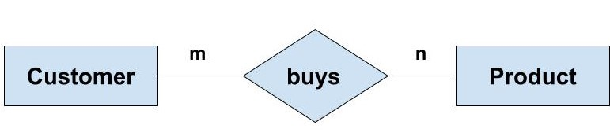
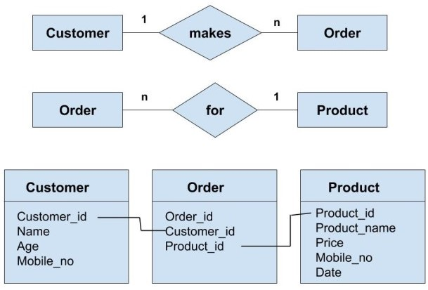
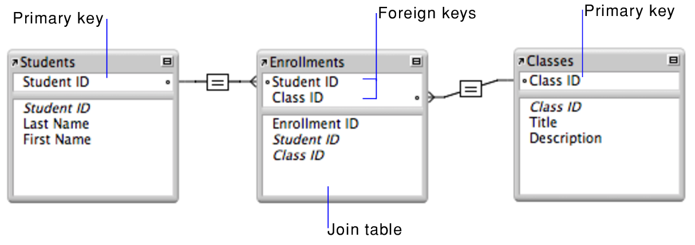

# Relational Database Structure
The objectives of this lesson are:
1. Understanding the fundamental and important concepts of databases
2. Learning about the different types of relationships

## Fundamental Database Concepts
We have already briefly discussed these in the previous lesson.

### Tables: Rows and Columns
The table is the basic data-storage unit in a relational database. Tables consist of columns and rows. The columns are the attributes or qualities that we want to express, while the rows hold the actual data.

Tables can have hundreds, thousands, sometimes even millions of rows of data. These rows are often called records. Tables can also have many columns of data. Columns are labeled with a descriptive name and have a specific data type. For example, a column called `age` may have a type of `INTEGER`.

### Primary Key
A primary key is a special column that uniquely identifies each record (row) in the table. The primary key column must be unique for each row, and must not contain any nulls (non-values).

### Foreign Key
We cannot talk about the yin of primary keys without the yang of foreign keys. The two go hand-in-hand. A primary key uniquely defines a record, while a foreign key is used to reference the same record from another table. We've already seen this in practice in the example from the previous lesson.

### Relationships
Relationships are THE reason why relational databases work so well. If you only learn one concept about databases, this is the one to learn. In relational databases, a relationship exists between two tables when one of them has a foreign key that references the primary key of the other table.

## Other Important Database Concepts
We have discussed the fundamental database concepts, but these are not the only ones. There are also other important secondary concepts worth learning about.

### Indexes
An index in an RDBMS is a data structure that works closely with tables and columns to speed up data retrieval operations. It works a lot like the index at the beginning of a book. In other words, it provides a reference point that allows you to quickly find and access the data you want without having to traverse the entire database.

### Schema
A schema is the structure behind data organization. It is a visual overview of how different tables are related to each other. This serves to map out and implement the underlying business rules for which the database is created.

### Normalization
Normalization is the process of (re)organizing data in a database so that it meets two basic requirements: there is no data redundancy (all data is stored in only one place), and data dependencies are logical (all related data items are stored together).

For instance, for a bank's database all customer static data, such as name, address and age, should be stored together. All account information, such as account holder, account type, account branch and so on, should also be stored together; it should also be stored separately from the customer static data.

### Constraints
In the RDBMS world, constraint refers to the exact same thing as in the real world. A constraint is a restriction on the type of data you can input into a certain column. Constraints are always defined on columns. A common constraint is the not-null constraint. It simply specifies that all rows in a table must have a value in the column defined as not null.

## Types of Relationships
Any association between two entity types is called a relationship. Entities take part in the relationship. For example, a teacher teaches students. Here, "teaches" is a relationship and this is the relationship between a Teacher entity and a Student entity.

Depending on the structure of your tables and the requirements of your application, you can create different types of relationships. There are three types of relationships that can exist between two entities.
- One-to-One Relationship
- One-to-Many or Many-to-One Relationship
- Many-to-Many Relationship

### One-to-One Relationship
For example, If there are two entities "Person" (Id, Name, Age, Address)and "Passport"(Passport_id, Passport_no). So, each person can have only one passport and each passport belongs to only one person.

Such a relationship is not very common. However, such a relationship is used for security purposes. In the above example, we can easily store the passport id in the "Person" table only. But, we make another table for the "Passport" because Passport number may be sensitive data and it should be hidden from certain users.

### One-to-Many or Many-to-One Relationship
Such a relationship exists when each record of one table can be related to one or more than one record of the other table. This relationship is the most common relationship found. A one-to-many relationship can also be said as a many-to-one relationship depending upon the way we view it.

For example, If there are two entity type "Customer" and "Account" then each "Customer" can have more than one "Account" but each "Account" is held by only one "Customer". In this example, we can say that each Customer is associated with many Account. So, it is a one-to-many relationship. But, if we see it the other way i.e many Account is associated with one Customer then we can say that it is a many-to-one relationship.

Let's take another similar example, a customer may have multiple orders. This is a one-to-many relationship, since one customer has many orders. It should be noted that the foreign key goes on the side that is "many".

### Many-to-Many Relationship
Such a relationship exists when each record of the first table can be related to one or more than one record of the second table and a single record of the second table can be related to one or more than one record of the first table.

For example, if there are two entity types "Customer" and "Product" then each customer can buy more than one product and a product can be bought by many different customers.

Many to many relationships often require an intermediate linking table that creates one-to-many relationships in two directions. First, each "Customer" can have many "Order" whereas each "Order" is related to only one "Customer". Second, each "Order" is related to only one Product wheres there can many orders for the same Product.

Let's look at another example for a many-to-many relationship. Consider students and classes at a university. A `Student` can take many classes; a `Class` also has many students. Once again you will need a linking table (also known as joining table or bridging table) to create this relationship. In this scenario, it can be `Enrollments`. This table contains the foreign keys of the two tables being connected. You can see in the diagram below, connecting classes and students together through a table called `Enrollments`. Each row in `Enrollments` represents one class that one student is taking; there can be multiple such entries in the table.

Check out this [StackOverflow question](https://stackoverflow.com/questions/4601703/difference-between-one-to-many-and-many-to-one-relationship) for more details about one-to-many and many-to-one relationships.

Now that you have a clearer picture of relational database structure, let's dive into how to interact with these databases using SQL in the next lesson.

---
## References
- https://www.techopedia.com/6/28832/enterprise/databases/introduction-to-databases
- https://afteracademy.com/blog/what-are-the-different-types-of-relationships-in-dbms
- https://dzone.com/articles/how-to-handle-a-many-to-many-relationship-in-datab