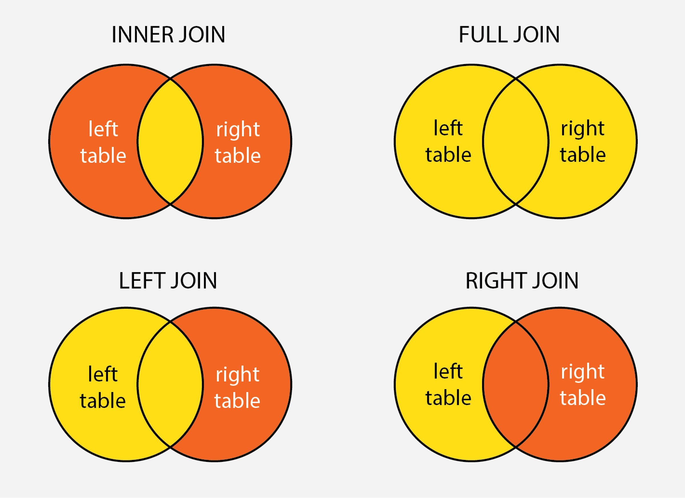

# Querying in SQL
How do we query the data in a relational database? The objectives of this lesson are:
1. Getting familiar with important SQL commands and their syntax
2. Getting familiar with fetching data from multiple tables

Note that every SQL database may have slightly different syntax in
terms of quotations, capitalization, commas, semicolons, etc. In the examples of this lesson, we will be using MySQL.

## Important SQL Commands
SQL is a collection of commands used to perform operations on the database and its tables. Here are some of the most commonly used commands.
- `SELECT` : extracts data from a database
- `INSERT INTO` : inserts new data into a database
- `UPDATE` : updates data in a database
- `DELETE` : deletes data from a database
- `CREATE DATABASE` : creates a new database
- `ALTER DATABASE` : modifies a database
- `CREATE TABLE` : creates a new table
- `ALTER TABLE` : modifies a table
- `DROP TABLE` : deletes a table
- `CREATE INDEX` : creates an index (search key)
- `DROP INDEX` : deletes an index

## Creating a new table
When starting a new project, firstly you will create a database which will house all your tables.
```sql
CREATE DATABASE myDatabase;
```
Now let's say you want to create a `customers` table, you would use the `CREATE TABLE` statement like this:
```sql
CREATE TABLE IF NOT EXISTS customers (
    customer_id INT AUTO_INCREMENT PRIMARY KEY,
    first_name VARCHAR(255) NOT NULL,
    last_name VARCHAR(255) NOT NULL,
    city VARCHAR(255) NOT NULL,
    created_at TIMESTAMP DEFAULT CURRENT_TIMESTAMP
)  
```

Note that every column has a data type like `INT`, `VARCHAR` and `TIMESTAMP`. In some cases the columns have been given additional definition rules. `AUTO_INCREMENT` is used to automatically generate IDs; when inserting a row, you do not need to provide the ID, it is automatically generated by incrementing the previous ID. `NOT NULL` is a constraint which means that the user cannot provide a `NULL` value for values in this column. `PRIMARY KEY` is used to denote the customer_id column as the primary key field, and it is often used in conjunction with `AUTO INCREMENT` for databases with numeric IDs.

There are many options when creating columns. Refer to the [documentation by MySQL](https://dev.mysql.com/doc/refman/8.0/en/create-table.html) for `CREATE TABLE`. You can also read about all the MySQL datatypes [in the documentation](https://dev.mysql.com/doc/refman/8.0/en/data-types.html).

## Inserting data
Once our table is created, we can add some data using `INSERT INTO`. Note that we do not need to manually provide an ID or a created timestamp, these are automatically generated by MySQL.
```sql
INSERT INTO customers (first_name, last_name, city) VALUES ('Jane', 'Doe', 'New York');
INSERT INTO customers (first_name, last_name, city) VALUES ('Joe', 'Smith', 'Istanbul');
```

## Viewing data
Now let's `SELECT` the data -- that is, let's view the data. To view all records with all fields:
```sql
SELECT * FROM customers;
```
The `*` symbol tells us to get all columns. The output would look something like this:
```
 customer_id | first_name | last_name |      city     |         created_at
-------------+------------+-----------+---------------+------------------------
  1          | Jane   | Doe     |  New York   |  2021-08-29 03:33:14.559122-07
  2          | Joe    | Smith   |  Istanbul   |  2021-08-29 03:34:08.522222-07
(2 rows)
```
You could also select only certain columns by typing the names of the column:
```sql
SELECT first_name, city FROM customers;
```
Depending on your requirements, you might have to use more specific keywords in your select statements. For example, you may want to use `SELECT DISTINCT` if you don't want to get repeating values for a column, or you may use the `WHERE` clause to apply additional conditions such as return only those rows where a specific condition for a column is met. You can explore [this track on W3 Schools](https://www.w3schools.com/sql/sql_select.asp) to explore all the different possibilities with `SELECT` queries.

You can refer to the [MySQL Reference Manual](https://dev.mysql.com/doc/refman/8.0/en/) to learn all the different types of query statements, keywords and clauses.

## Creating relationships
Let's create a table with a foreign key, the `orders` table, noting the syntax that is used to create a foreign key that references our `customers` table.
```sql
CREATE TABLE orders (
  order_id INT AUTO_INCREMENT PRIMARY KEY,
  product VARCHAR(255) NOT NULL,
  delivered BOOL,
  customer_id INT FOREIGN KEY REFERENCES customers(customer_id)
);
```
Now we can have one-to-many relationships from `customers` to `orders`.

## Joining tables
Sometimes all data would not be stored in the same table. You may have created relationships between your tables like in the above example. **Join** refers to the process of combining two or more tables together based on a common column.

There are different types of joins:
- Inner join returns rows with at least one match in both tables.
- Left (outer) join returns rows from left table and the matched rows from right table.
- Right (outer) join returns rows from right table and the matched rows from left table.
- Full (outer) join returns rows with a match in either of the two tables.



The most commonly used type of join is the inner join. Let's continue with our example of `customers` and `orders` related tables. If we want to answer, in one query,
the question: what did Joe order? We would write a query like so:
```sql
SELECT product FROM orders INNER JOIN customers ON orders.customer_id =
customers.id WHERE customer.customer_id = 2;
```
Basically, we are retreiving the `product` in the `order` by the `customer` whose `customer_id` is 2 by joining the `orders` and `customers` tables.

You can read more about [SQL joins](https://www.educative.io/blog/what-are-sql-joins) here.

## Continue learning
We have tried to introduce you to the fundamental concepts of SQL in this lesson. This is of course not an exhaustive set of everything SQL has to offer. We recommend you also do some learning on your own.

If you want to first do a quick check of how well you have understood the basics of SQL, take this short [SQL Quiz](https://www.w3schools.com/quiztest/quiztest.asp?qtest=SQL) on W3 Schools.

If you want to spend some more time learning SQL, you can take [this simple course on Codecademy](https://www.codecademy.com/catalog/language/sql).

[This repository](https://github.com/LambdaSchool/Relational-Databases) is
a good additional resource for reviewing SQL databases, PostgreSQL and some common parts of the query language.

When in doubt, you can always simply Google, for example, "how to select in MySQL" and check StackOverflow, MySQL documentation or any popular tutorial blog.

You know our approach in this bootcamp, which is to learn by doing. With everything we have read and understood about SQL so far, we will now work on an assigment with SQL queries to get hands-on experience of working with relational databases.

---
## References
- https://www.educative.io/blog/what-are-sql-joins
- https://medium.com/@a.i.gorina/sql-101-2616d7064320