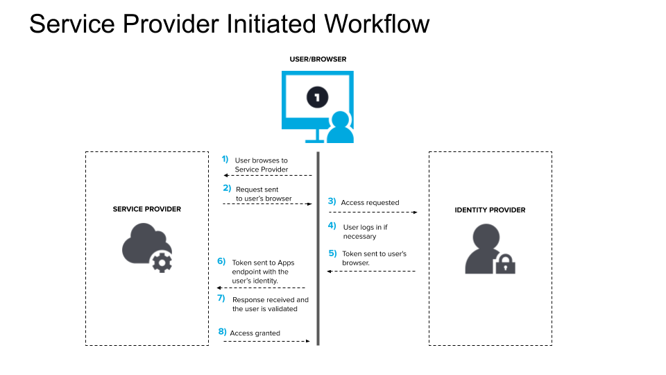
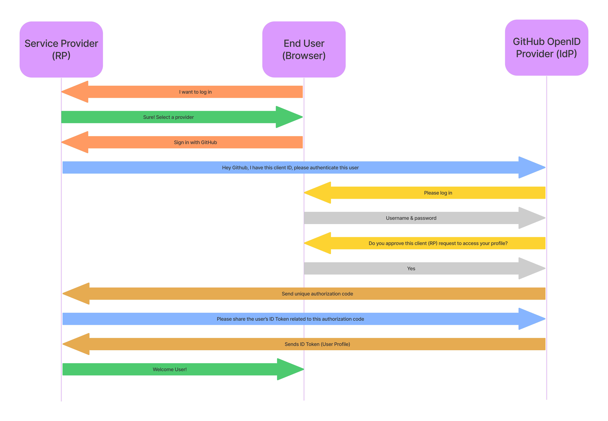
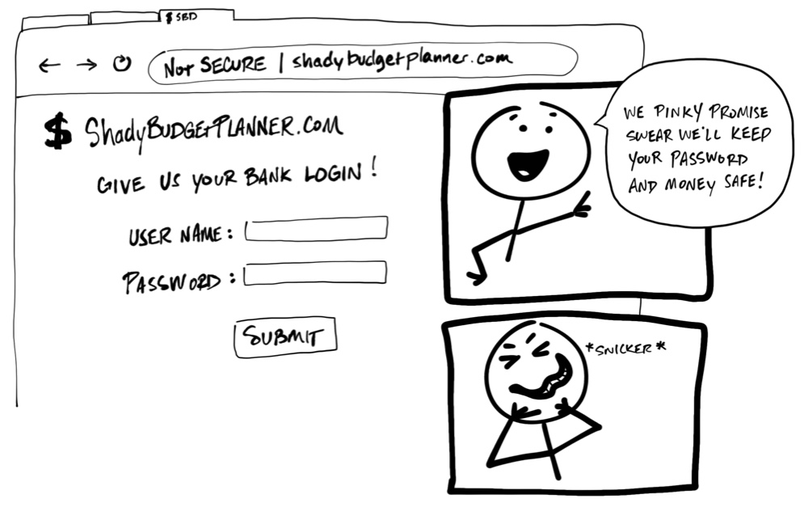
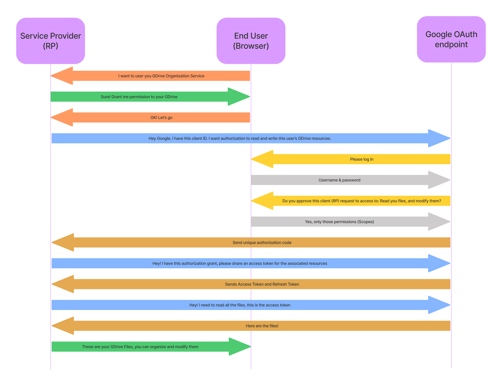

# APIs auth schemes: Single Sign-On, OpenID Connect, and OAuth

In this lesson, we will explore authorization and authentication standards for cross-domain sessions and services. We will tackle single sign-on as a way to have universal account for multiple services. Then we wrap that with the OpenID Connect standard that offers decentralized authentication protocol which operates over OAuth standard. OAuth in its turn offers a way for apps to communicate between each other on your behalf as an authorization framework. The learning objectives are:

- You will get to know how to use each of these standards and how do they work
- The difference between ID Tokens, Access Tokens, and Refresh Tokens
- When and why we would need OAuth
- What is scoped access control

## Single Sign-On

Single sign-on (SSO) is an authentication method that enables users to securely authenticate with multiple applications and websites by using just one set of credentials. It occurs when a user logs in to one application and is then signed in to other applications automatically, regardless of the platform, technology, or domain the user is using. The user signs in only one time, hence the name of the feature (Single Sign-on).

For example, if you log in to a Google service such as Gmail, you are automatically authenticated to YouTube, Google Drive, AdSense, Google Analytics, and other Google apps. Likewise, if you log out of your Gmail or other Google apps, you are automatically logged out of all the apps; this is known as Single Logout.

SSO provides a seamless experience for users when using your applications and services. Instead of having to remember separate sets of credentials for each application or service, users can simply log in once and access your full suite of applications.

Whenever users go to a domain that requires authentication, they are redirected to the authentication domain where they may be asked to log in. If the user is already logged in at the authentication domain, they can be immediately redirected to the original domain without signing in again.

### How does SSO work?

SSO works based upon a trust relationship set up between an application, known as the service provider, and an identity provider, like [OneLogin](https://www.onelogin.com/) or [Auth0](https://auth0.com/). This trust relationship is often based upon a certificate that is exchanged between the identity provider and the service provider. This certificate can be used to sign identity information that is being sent from the identity provider to the service provider so that the service provider knows it is coming from a trusted source. In SSO, this identity data takes the form of JWTs which contain identifying bits of information about the user like a user’s email address or a username.

The login flow usually looks like this:

1. A user browses to the application or website they want access to, aka, the Service Provider.
2. The Service Provider sends a token that contains some information about the user, like their email address, to the SSO system, aka, the Identity Provider, as part of a request to authenticate the user.
3. The Identity Provider first checks to see whether the user has already been authenticated, in which case it will grant the user access to the Service Provider application and skip to step 5.
4. If the user hasn’t logged in, they will be prompted to do so by providing the credentials required by the Identity Provider. This could simply be a username and password or it might include some other form of authentication like a One-Time Password (OTP).
5. Once the Identity Provider validates the credentials provided, it will send a token back to the Service Provider confirming a successful authentication.
6. This token is passed through the user’s browser to the Service Provider.
7. The token that is received by the Service Provider is validated according to the trust relationship that was set up between the Service Provider and the Identity Provider during the initial configuration.
8. The user is granted access to the Service Provider.



### SSO Implementation

SSO Implementation in your backend app will depend heavily on the Identity Provider that you choose. Most IdP use the OpenID Connect (OIDC) protocol to offer SSO. However, some enterprises rely on [Security Assertion Markup Language (SAML)](https://www.onelogin.com/learn/saml) open standard to exchange authorization and identity.

We won't be covering SAML for SSO in this lesson, but you can learn more on how to use OIDC in your application in the next section.

## OpenID Connect

OpenID is also an open standard and decentralized authentication protocol promoted by the non-profit OpenID Foundation. It allows users to be authenticated by cooperating sites (known as relying parties, or RP) using a third-party identity provider (IdP) service, eliminating the need for webmasters to provide their own ad hoc login systems, and allowing users to log into multiple unrelated websites without having to have a separate identity and password for each.

If you ever used Sign in with Google, or Sign in with Github, then you've used the OpenID standard that was coupled with OAuth protocol to share your identity with 3rd party applications.

Let's take Github's as an example, when you click the sign in button, the app (RP) will redirect your to the Github sign in page that is hosted on github.com domain. When you sign in, you will be redirected to the permissions or authorization page where it will ask for your consent to authorize sharing your identity with the Service Provider (RP). Once you give consent, Github will redirect you to a callback URL that the service provider already shared with Github and attach a unique authorization code to the request. The app or service provider will use that code to contact the IdP for your profile.



### OpenID vs OpenID Connect

It might get confusing when you start searching within these standards. You will find there is a distinction between OpenID and OpenID Connect, each using a different response type and protocol. For now, OpenID older revisions are mostly deprecated and the acceptable standard is OpenID Connect over OAuth 2.0. Quoting a great [answer on Stack Overflow](https://security.stackexchange.com/a/130411) talking more about this topic.

#### Simple Terms

- OpenID is about verifying a person's identity (authentication).
- OAuth is about accessing a person's stuff (authorization).
- OpenID Connect does both.

All three let a person give their username/password (or other credential) to a trusted authority instead of to a less trusted app.

#### More Details

To understand something, look at its history.

OpenID & OAuth have developed on parallel tracks and in 2014 merged into OpenID Connect. Throughout their history, OpenID and OAuth have let an app use a trusted authority to handle private user credentials. Whereas OpenID let the authority verify a user's identity, OAuth let the authority grant limited access to a user's stuff.

**OpenID 1.0** (2006) lets an app ask an authority for proof that an end user owns an identify (a URL).

- End user to app: I am Steve A. Smith.
- App to authority: Is this Steve A. Smith?
- The end user and authority speak for a moment.
- Authority to app: Yes, that is Steve A. Smith.
- OpenID 2.0 (2007) does the same, but adds a second identity format (XRI) and adds flexibility to how the end user specifies the identity and authority.

**OpenID Attribute Exchange 1.0** (2007) extends OpenID 2.0 by letting an app fetch & store end user profile information with the authority - in addition to verifying the end user's identity.

- End user to app: I am Steve A. Smith.
- App to authority: Is this Steve A. Smith? Oh, and if it is, also fetch me his email address and phone number.
- The end user and authority speak for a moment.
- Authority to app: Yes, that is Steve A. Smith. His email is steve@domain.com and phone number is 123-456-7890.

**OAuth 1.0** (2010) lets an end user grant an app limited access to resources on a third-party server that an authority owns.

- App to end user: We'd like to access your pictures on some other server.
- The end user and authority speak for a moment.
- Authority to app: Here is an access token.
- App to third-party server: Here is the access token that proves I am allowed to access pictures for an end user.

**OAuth 2.0** (2012) does the same thing as OAuth 1.0 but with a completely new protocol.

**OpenID Connect** (2014) combines the features of OpenID 2.0, OpenID Attribute Exchange 1.0, and OAuth 2.0 in a single protocol. It allows an application to use an authority...

- to verify the end user's identity,
- to fetch the end user's profile info, and
- to gain limited access to the end user's stuff.

### Consuming OpenID standard

To use OpenID standard for authentication in your app, you need to register an OAuth client application to the provider or providers you would like to use.

Most mainstream identity providers offer identity using OAuth protocol with OIDC, so you need to create the application using the provider's platform.

Once the app is created, you will be handed a client ID and a client secret which shouldn't be shared with anyone. Some providers like facebook also require that you define your needed app scopes when creating the app. We will talk about scopes in the next section, but for identity, the scope you need is `openid`. This scope makes the identity provider share an ID token with your app that contains the user details, like thier name, email, profile picture, and so on.

While this is an open standard that should, more or less, have similiar implementations, providers tend to adjust the flow or the output. To simplify consuming federated identity via OpenID, there are libraries out there that makes the integration very straightforward. One such library is [Passport.js](https://www.npmjs.com/package/passport).

### Passport.js

Passport is [Express](http://expressjs.com/)-compatible authentication middleware for [Node.js](http://nodejs.org/).

Passport's sole purpose is to authenticate requests, which it does through an extensible set of plugins known as _strategies_. Passport does not mount routes or assume any particular database schema, which maximizes flexibility and allows application-level decisions to be made by the developer. The API is simple: you provide Passport a request to authenticate, and Passport provides hooks for controlling what occurs when authentication succeeds or fails.

What's cool about Passport, is you can combine multiple providers in your app, giving users the choice to use the provider they prefer while delegating the implementation details to Passport.js.

### Passport.js strategies

[Passport](https://www.npmjs.com/package/passport) npm library comes with basic middleware and implementation, however, to use it, you need to also install the required plugins for your authentication routes. These plugins are called [strategies](http://www.passportjs.org/packages/).

If your app uses email and password to authenticate users, then you will need to install the [`passport-local`](http://www.passportjs.org/packages/passport-local/) strategy. And if you are also adding logging in with google, then you will need to install the [`passport-google`](http://www.passportjs.org/packages/passport-google/) strategy. And so on.

Below is an example to add Login with Github to your app using [`passport-github2`](http://www.passportjs.org/packages/passport-github2/) strategy

```js
passport.use(
  new GitHubStrategy(
    {
      clientID: GITHUB_CLIENT_ID,
      clientSecret: GITHUB_CLIENT_SECRET,
      callbackURL: "http://127.0.0.1:3000/auth/github/callback",
    },
    function (accessToken, refreshToken, profile, done) {
      User.findOrCreate({ githubId: profile.id }, function (err, user) {
        return done(err, user);
      });
    }
  )
);
```

The code sets up the strategy with your OAuth Github Client credentials, and a callback URL that Github will contact to share authorization code. Once the identity is fetched, we need to register a user or log them in using thier Github `profile.id`.

To authenticate requests, use passport.authenticate(), specifying the 'github' strategy.

```js
app.get(
  "/auth/github",
  passport.authenticate("github", { scope: ["user:email"] })
);

app.get(
  "/auth/github/callback",
  passport.authenticate("github", { failureRedirect: "/login" }),
  function (req, res) {
    // Successful authentication, redirect home.
    res.redirect("/");
  }
);
```

In the last code snippet we used the scope `user:email` to also fetch the user email from Github whether private or public. That is only if we needed the emails because the scope `openid` will only share an identity and public emails.

[](https://codesandbox.io/s/github-openid-lpuy4?fontsize=14&hidenavigation=1&theme=dark)

## OAuth 2.0

Now that we covered SSO, and OpenID Connect, we can cover the OAuth 2.0 standard that OIDC is built upon.

If you remember, back in the days (c. 2005), when you logged in to Yahoo mail, and you wanted to import your emails and contacts from another provider, like Gmail, Yahoo would ask you to share your Gmail password so they can login as you to Gmail, and download your data, then upload it to Yahoo's server! Sneaky! That was because at the time there wasn't a standard that allow communication between services on your behalf. You have to trust Yahoo with your password, and that would give them full access and control over your Gmail!

This scheme was prominent in many apps, like asking for your bank username and password, to read your bank statement and offer you budget planning.


_Image rights belong to [Okta Developers](https://developer.okta.com/blog/2019/10/21/illustrated-guide-to-oauth-and-oidc)_

You should never be required to share your username and password, your credentials, to another service. There’s no guarantee that an organization will keep your credentials safe, or guarantee their service won’t access more of your personal information than necessary. It might sound crazy, but some applications still try to get away with this!

To the rescue comes OAuth, an agreed-upon standard to securely allow one service to access data from another.

Suppose you are building an application that allows users to read their Google Drive files as well as upload files and organize documents. In order to access the user's GDrive, you need to direct the user to Google so that they can share with you access to their GDrive. Then Google will share an access token with you on the user behalf that gives your app access to user's resources in google drive.



Using the access token, and the provided permissions, the service provider can keep accessing the user's resources as long as the access token is valid. It can get expired, in that case a the refresh token can be used to request another access token.

One important concept to remember, is to not mix between authentication and authorization in OAuth, OpenID Connect uses the OAuth standard for simplicity and easier integration, however they are completely different in terms of usage concept. That's why we aren't using Passport for Authorization because it has the sole purpose of authentication. For more details, head to this [article by Okta Developers](https://developer.okta.com/blog/2019/10/21/illustrated-guide-to-oauth-and-oidc).

### Requesting Authorization

You can request authorization in 1 step when the user logs in, in that flow, you request the `openid` scope along with other scopes your app needs. However, in that flow, your permissions need to be clearly stated to the user with their use cases. Otherwise a user might refuse to grant certain permissions.

The other flow, is to seperate authorization over multiple steps, when needed. You can start with base scopes, like profile and read access, then whenever your app needs more access, you clarify to the user, and direct them to the resource owner for that additional scope or permission.

In all cases, you need to use an OAuth 2.0 client library like [`client-oauth2`](https://www.npmjs.com/package/client-oauth2), or [`simple-oauth2`](https://www.npmjs.com/package/simple-oauth2) to communicate with OAuth providers. Sometimes, the providers have their own library to use like [Google OAuth client libraries](https://developers.google.com/identity/protocols/oauth2/web-server#httprest) and [Octokit](https://github.com/octokit).

You can check the codesandbox below for live implementation of OAuth to read a user's private repository after they login with Github.

[](https://codesandbox.io/s/github-oauth-q576g?fontsize=14&hidenavigation=1&theme=dark)

### OAuth Server

So far, what we've seen and implemented are consuming an OAuth server using and OAuth client. However, if your application contains resources that you want to give 3rd party services access to, you need to integrate your own OAuth server.

To integrate and OAuth server, most of the heavy lifting need to be done by your app, like creating the API and enforcing scopes, however, there are libraries out there tha makes the process of issuing client ids, secrets, and access tokens easier. You can do your own research on this topic.
