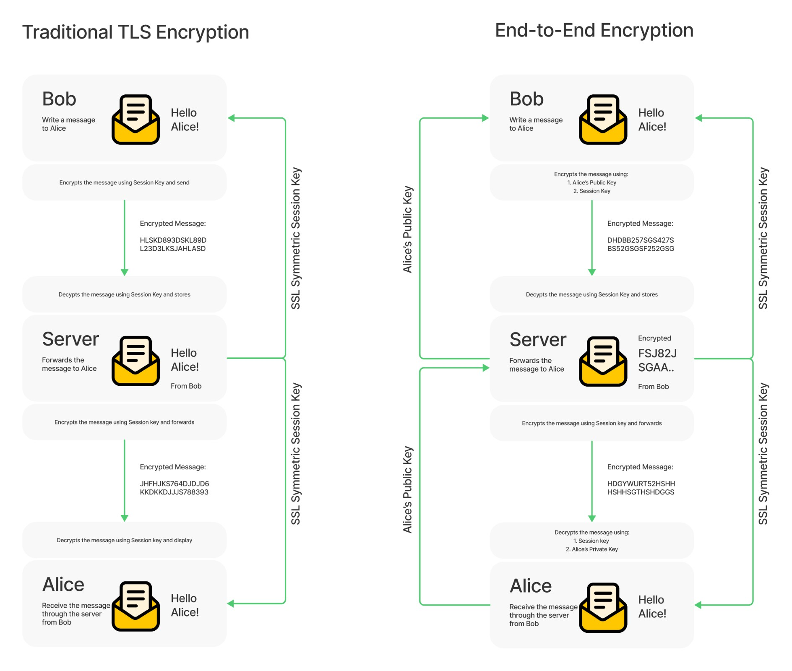

# Other Security Vulnerabilities and Practices

In this lesson, we will go over different attack trajectories and vulnerabilities. Some are from the list of the [OWASP Top 10](https://owasp.org/www-project-top-ten/).

This document is intended to help you know where to go look patterns and visualize the security of your app. It is a non exhaustive list not to mention that it should be revised anually.

In this lesson you will learn about:

- Cross-site request forgery
- Database Security & Injection attacks
- End-to-end encryption
- Rate limiting

## Cross-site request forgery (CSRF)

[CSRF](https://cheatsheetseries.owasp.org/cheatsheets/Cross-Site_Request_Forgery_Prevention_Cheat_Sheet.html) is an attack that forces an end user to execute unwanted actions on a web application in which they're currently authenticated. With a little help of social engineering (such as sending a link via email or chat), an attacker may trick the users of a web application into executing actions of the attacker's choosing. If the victim is a normal user, a successful CSRF attack can force the user to perform state changing requests like transferring funds, changing their email address, and so forth. If the victim is an administrative account, CSRF can compromise the entire web application.

### How does it work?

For a [CSRF](https://portswigger.net/web-security/csrf) attack to be possible, three key conditions must be in place:

- **A relevant action**. There is an action within the application that the attacker has a reason to induce. This might be a privileged action (such as modifying permissions for other users) or any action on user-specific data (such as changing the user's own password).
- **Cookie-based session handling**. Performing the action involves issuing one or more HTTP requests, and the application relies solely on session cookies to identify the user who has made the requests. There is no other mechanism in place for tracking sessions or validating user requests.
- **No unpredictable request parameters**. The requests that perform the action do not contain any parameters whose values the attacker cannot determine or guess. For example, when causing a user to change their password, the function is not vulnerable if an attacker needs to know the value of the existing password.

For example, suppose an application contains a function that lets the user change the email address on their account. When a user performs this action, they make an HTTP request like the following:

```js
app.post("/email/change", async (req, res) => {
  const userId = req.session.user.id;
  const user = await User.findOne(userId);
  const { newEmail } = req.body;
  if (!userId || !user) {
    return res.status(403).end();
  }

  user.email = newEmail;
  await user.save();
  res.status(200).end();
});
```

If this app is not protected against CSRF, it meets the conditions required for CSRF:

- The action of changing the email address on a user's account is of interest to an attacker. Following this action, the attacker will typically be able to trigger a password reset and take full control of the user's account.
- The application uses a session cookie to identify which user issued the request. There are no other tokens or mechanisms in place to track user sessions.
- The attacker can easily determine the values of the request parameters that are needed to perform the action.

With these conditions in place, the attacker can construct a web page containing the following HTML:

```html
<html>
  <body>
    <form action="https://vulnerable-website.com/email/change" method="POST">
      <input type="hidden" name="newEmail" value="pwned@evil-user.net" />
    </form>
    <script>
      document.forms[0].submit();
    </script>
  </body>
</html>
```

If a victim user visits the attacker's web page, the following will happen:

- The attacker's page will trigger an HTTP request to the vulnerable web site.
- If the user is logged in to the vulnerable web site, their browser will automatically include their session cookie in the request (assuming `SameSite` cookies are not being used).
- The vulnerable web site will process the request in the normal way, treat it as having been made by the victim user, and change their email address.

### Preventing CSRF attacks

The most robust way to defend against CSRF attacks is to include a [CSRF token](https://portswigger.net/web-security/csrf/tokens) within relevant requests. The token should be:

- Unpredictable with high entropy, as for session tokens in general.
- Tied to the user's session.
- Strictly validated in every case before the relevant action is executed.
- An additional defense that is partially effective against CSRF, and can be used in conjunction with CSRF tokens, is SameSite cookies.
- Implement CORS policies

> 💡 TIP: In express based web apps, you can use the middleware library [`csurf`](http://expressjs.com/en/resources/middleware/csurf.html) to enforce CSRF Tokens in your apps. You can also use [`cors`](https://expressjs.com/en/resources/middleware/cors.html) to enforce CORS policies.

## Databse security

Database security can be discussed in two folds:

- How to mitigate attacks against the database server itself
- How to mitigate attacks through your server backend app

### Attacks against database server

[Cheat Sheet](https://cheatsheetseries.owasp.org/cheatsheets/Database_Security_Cheat_Sheet.html)

A database server is the system that hosts your database. It offers access points and tools as API for applications to interact with the database. Lack of security configuration, or malconfig can pose a great threat that risks giving access to databases.

Below are the common facets of database server that should be secured:

- [Connection](https://cheatsheetseries.owasp.org/cheatsheets/Database_Security_Cheat_Sheet.html#connecting-to-the-database)
  - [Transport Layer Protection](https://cheatsheetseries.owasp.org/cheatsheets/Database_Security_Cheat_Sheet.html#transport-layer-protection)
- [Authentication](https://cheatsheetseries.owasp.org/cheatsheets/Database_Security_Cheat_Sheet.html#authentication)
  - [Credentials storage](https://cheatsheetseries.owasp.org/cheatsheets/Database_Security_Cheat_Sheet.html#storing-database-credentials)
- [Permissions](https://cheatsheetseries.owasp.org/cheatsheets/Database_Security_Cheat_Sheet.html#permissions)
- [Configurations and Hardening](https://cheatsheetseries.owasp.org/cheatsheets/Database_Security_Cheat_Sheet.html#database-configuration-and-hardening)

#### Database connection

Before securing our backend app, it is of utmost security to secure the database server itself, since most attackers will try to access the database api directly over network. Thus it is important that the backend database used by the application to be isolated as much as possible, in order to prevent malicious or undesirable users from being able to connect to it. Exactly how this is achieved will depend on the system and network architecture. The following options could be used to protect it:

- Disabling network (TCP) access and requiring all access is over a local socket file or named pipe.
- Configuring the database to only bind on localhost.
- Restricting access to the network port to specific hosts with firewall rules.
- Placing the database server in a separate [demilitarized zone (DMZ)](https://www.fortinet.com/resources/cyberglossary/what-is-dmz) isolated from the application server.

Similar protection should be implemented to protect any web-based management tools used with the database, such as phpMyAdmin.

#### Storing Database Credentials

Database credentials should never be stored in the application source code, especially if they are unencrypted. Instead, they should be stored in a configuration file that:

- Is outside of the webroot.
- Has appropriate permissions so that it can only be read by the required user(s).
- Is not checked into source code repositories.

Where possible, these credentials should also be encrypted or otherwise protected using built-in functionality, such as the web.config encryption available in ASP.NET.

> 💡 TIP: Most database systems come with a security checklist to ensure your database server is secure. Checkout this security checklist for [MongoDB](https://docs.mongodb.com/manual/administration/security-checklist/).

### Injection attacks

[Cheat Sheet](https://cheatsheetseries.owasp.org/cheatsheets/SQL_Injection_Prevention_Cheat_Sheet.html)

Injection attacks target the web app or the backend server through its interaction with the database. The most prominent is [SQL injection](https://portswigger.net/web-security/sql-injection) which is a web security vulnerability that allows an attacker to interfere with the queries that an application makes to its database. It generally allows an attacker to view data that they are not normally able to retrieve. This might include data belonging to other users, or any other data that the application itself is able to access. In many cases, an attacker can modify or delete this data, causing persistent changes to the application's content or behavior.

#### Example: Revealing hidden data

Imaging having an ecommerse application that has an endpoint that display products by categories. Some of these products are _unreleased_ yet, so they shouldn't show up in the results.

```js
// /products?category=Digital
app.get("/products", async (req, res) => {
  const { category } = req.query;
  const SQL = `SELECT * FROM products WHERE category = '${category}' AND released = 1`;
  const results = await db.query(SQL);

  res.json(results);
});
```

This SQL query asks the database to return:

- all details `*`
- from the `products` table
- where the `category` is Digital
- and `released` is 1.

The application doesn't implement any defenses against SQL injection attacks, so an attacker can construct an attack like:

```
https://insecure.com/products?category=Digital'--
```

This results in the SQL query:

```SQL
SELECT * FROM products WHERE category = 'Digital'--' AND released = 1
```

If syntax highlighting is working correctly, you will probably notice the difference right away. The addition of `--` in SQL means what ever follows in this line is a comment and should be ignored! This effectively removes the remainder of the query, so it no longer includes `AND released = 1`. This means that all products are displayed, including unreleased products.

Going further, an attacker can cause the application to display all the products in any category, including categories that they don't know about:

```
https://insecure.com/products?category=Gifts'+OR+1=1--
```

This results in the SQL query:

```sql
SELECT * FROM products WHERE category = 'Gifts' OR 1=1--' AND released = 1
```

The modified query will return all items where either the category is Gifts, or 1 is equal to 1. Since 1=1 is always true, the query will return all items.

Checkout more examples in [this article](https://portswigger.net/web-security/sql-injection).

### Preventing SQL Injection

First and foremost, try to use an ORM, it solves most of these problems for you. And never construct a query by string concatenation or interpolation.
The cheatsheet from OWASP has a good compilation for best practices. We will summarize it here

- Use Prepared Statements (with Parameterized Queries)
- Use Stored Procedures
- Use Allow-list Input Validation
- Escaping (Sanitizing) All User Supplied Input

Most ORMs offer a query preparation methods, that help you write a query with placeholder that get filled (replaced) later. For example in [Sequlize](https://sequelize.org/master/manual/raw-queries.html#replacements):

```js
// /products?category=Digital
app.get("/products", async (req, res) => {
  const { category } = req.query;

  const SQL =
    "SELECT * FROM products WHERE category = :category AND released = :released";

  const PARAMS = {
    replacements: { category, released: "1" },
    type: QueryTypes.SELECT,
  };

  const results = await sequelize.query(SQL, PARAMS);

  res.json(results);
});
```

## End-to-end encryption (E2EE)

End-to-end encryption is a secure way to communicate privately and securely online. By encrypting communication at both ends of a conversation, end-to-end encryption prevents anyone in the middle from reading private communications.



Imagine building a meetings application that have your server in the middle to fascilitate communication, and at least 2 or more clients connected to the server in a meeting session.

The client would record audio, video, and chat messages, and send them to the server. The server then send this data to the other clients connected to this meeting session. This back and forth communication is all fascilitated by your server.

When your server implement E2EE, it needs to fascilitate client's handshake and encryption keys exchange. This is mainly to exchange Public Keys of clients to encrypt the outward communication. Any video, audio, or text sent should be encrypted using a public key. Then when it is received, it can be decrypted using the private key associated with the public key.

### Advantages of E2EE

- Safe against hacks: All stored data are encrypted. In case the server was breached, an attacker will have a pile of gibberish
- More privacy: No one will be to read your data except you.

### Disadvantages of E2EE

- Services won't be able to offer features to enhance your data, like offering transcript feature to your meetings, or recommendations and suggestions.
- Measure to store and rotate encryptions keys are required. If by accident a user lost their key, they will effectivley lose all their data

## Rate Limiting

Rate limiting is a strategy for limiting network traffic. It puts a cap on how often someone can repeat an action within a certain timeframe – for instance, trying to log in to an account.

Rate limiting can help stop certain kinds of malicious bot activity. It can also reduce strain on web servers.

In express, you can use a middleware like [`express-rate-limit`](https://www.npmjs.com/package/express-rate-limit) to control this behavior. This is a necessity especially for API to limit computerized bots from breaking your api server.

You can also use [CAPTCHA](https://www.pandasecurity.com/en/mediacenter/panda-security/what-is-captcha/) to for Non-API server apps to make sure some certain actions are only done by humans.

A library like [`express-recaptcha`](https://www.npmjs.com/package/express-recaptcha) can be used to add CAPTCHA to your app.

You can also use cloud services that are built to mitigate such attacks like [CloudFlare](https://www.cloudflare.com/learning/bots/what-is-rate-limiting/). They proxy your app through extensive security tests and practices to ensure your server won't go down due to bot attacks.

## Further reading

- REST Security [cheatsheet](https://cheatsheetseries.owasp.org/cheatsheets/REST_Security_Cheat_Sheet.html)
- [Serverside request forgery](https://portswigger.net/web-security/ssrf) (SSRF) & [cheatsheet](https://cheatsheetseries.owasp.org/cheatsheets/Server_Side_Request_Forgery_Prevention_Cheat_Sheet.html)
- [Cross-site scripting](https://portswigger.net/web-security/cross-site-scripting) (XSS) & [cheatsheet](https://cheatsheetseries.owasp.org/cheatsheets/DOM_based_XSS_Prevention_Cheat_Sheet.html)
- [OAuth 2.0 authentication vulnerabilities](https://portswigger.net/web-security/oauth)
