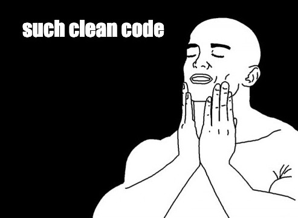

# Static Analysis Testing

What are some ways to ensure clean and correct code even before we run our unit tests? Can we enforce certain best practices for all team members while they're writing the code itself? The objectives of this lesson are:

1. Understanding the need for static analysis testing and how it is different from unit testing
2. Understanding the different tools that help with writing well-formatted code

## What is static analysis testing?

Static analysis is a method of debugging by examining source code before a program is run. It's done by analyzing a set of code against a set (or multiple sets) of coding rules. In simpler words, static analysis identifies defects before you run a program (between coding and unit testing) while dynamic analysis identifies defects after you run a program (during unit testing).

So far everything we learned was related to dynamic analysis. Static analysis is the process of verifying that your code meets certain expectations without actually running it. Unlike unit and integration testing, static analysis can be performed on raw source code without the need for a web server or build process. Static analyzers typically parse your code and turn it into what is known as an abstract syntax tree. This tree is then traversed and the pieces are checked based on the rules dictated by the static analyzer. Most static analyzers also include a way for developers to write their own custom rules, but that varies from tool to tool. Static analysis is most commonly used to:

- Ensure consistent style and formatting
- Check for common mistakes and possible bugs
- Limit the complexity of code
- Verify type consistency
- Minimize security risks
- Keep third-party dependencies up to date

There are many popular tools for implementing static analysis on JavaScript or Node.js codebases, and you can read about some of those [here](https://blog.logrocket.com/static-analysis-in-javascript-11-tools-to-help-you-catch-errors-before-users-do/).

We'll look into some of the most commonly used tools, that we recommend you should use during this bootcamp as well.

## ESLint

[ESLint](https://eslint.org/) is probably the most used static analysis tool for JavaScript. It is mainly a tool for [linting](<https://en.wikipedia.org/wiki/Lint_(software)>), as in a tool that programmatically scans your code with the goal of finding issues that can lead to bugs or inconsistencies with code health and style and sometimes even fix those issues automatically.

ESLint is very easy to [setup](https://www.section.io/engineering-education/node-eslint/) and also comes with many [predetermined rules](https://eslint.org/docs/rules/) that you can configure for your project. It also gives the option to extend a set of rules prepared by another reliable company or developer, so that we don't have to list down all the rules from scratch. You can ovverride a few rules if required from the extended set.

You can read more about configuring ESLint [here](https://eslint.org/docs/user-guide/configuring/). Or go back to some of the previous assignments, specifically module 4 assignments which had a `.eslintrc` file.

## Prettier

While ESlint does take care of code formatting to a large extent, quite often it is paired with [Prettier](https://prettier.io/). Prettier focusses more on code formatting and as such is not a fully-featured linter in itself. For example, Prettier can manage code formatting rules like `max-len`, `no-mixed-spaces-and-tabs`, `keyword-spacing`, `comma-style` but cannot handle code quality rules like `no-unused-vars`, `no-extra-bind`, `no-implicit-globals` and `prefer-promise-reject-errors`. You can read more about the specific benefits of Prettier [here](https://prettier.io/docs/en/why-prettier.html).

Once again Prettier is quite easy to [setup](https://sourcelevel.io/blog/how-to-setup-eslint-and-prettier-on-node) along with ESLint. You can read more about configuration [here](https://prettier.io/docs/en/install.html) and take a look at the `prettierrc` file from module 4 assignments.

## VSCode Extensions

We strongly recommend that you must install the extensions for ESLint and Prettier on your VSCode, that is if you haven't already.

- [ESLint extension for VSCode](https://marketplace.visualstudio.com/items?itemName=dbaeumer.vscode-eslint)
- [Prettier extension for VSCode](https://marketplace.visualstudio.com/items?itemName=esbenp.prettier-vscode)

These will ensure that the rules from your project's `eslintrc` and `prettierrc` or `prettier.config` files are always applied. Your editor will highlight linting and formatting errors while you code so that you can fix them on the go, and also apply automatic formatting each time you save the file. You can read more about using these extensions on [this article](https://enlear.academy/integrating-prettier-and-eslint-with-vs-code-1d2f6fb53bc9).

## Executing static analysis

We can run our static analysis tools just like we executed our unit tests using the command `npm test` which was possible by defining the test script in our `package.json` files.

```js
{
  ...
  "scripts": {
    ...
    "test": "jest"
  },
  ...
}
```

We can add a script to run ESLint as:

```js
"lint": "eslint ."
```

And then the command `npm run eslint` checks all JS files in our code for lint errors.

However, we need some JS files to be ignored by ESLint such as those in `node_modules` or maybe if we have a `build` folder then those too. In that case, we can reuse the `.gitignore` file which already tell git to ignore tracking certain set of files and folders and modify our script to:

```js
"lint": "eslint --ignore-path .gitignore ."
```

Similarly, we can write another script to run prettier formatting as:

```js
"format": "prettier --ignore-path .gitignore --write \"**/*.+(js|json)\""
```

And voila, `npm run format` will now use prettier config rules to apply formatting corrections on al js and json files in the project, except those that should be ignored.

We can also have a joint script for both lint and format as:

```js
"validate": "npm run format && npm run lint"
```

Now we can execute `npm run validate` before pushing any major code change to GitHub or deploying to production.

Using a common set of linting and formatting rules enforced by ESLint and Prettier boost team productivity and ensure that all developers in the team are writing clean and consistent code in a shared codebase. We will try to use these tools in most assignments going forward and strongly recommend that you use them in your own projects as well. The feeling of looking at clean and readable code can often be therapeutic, given that this job can otherwise get very stressful stuck in the land of debugging. A combination of static analysis and dynamic testing leads to well-maintained and robust code!


