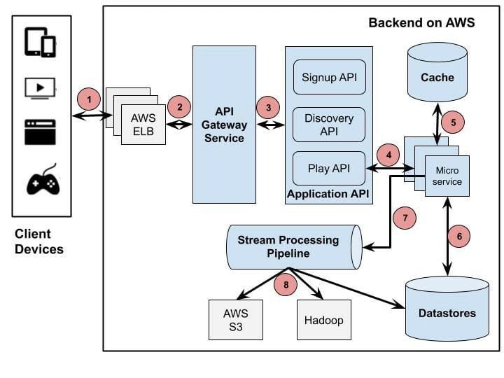

# Introduction to Architecture

We have reached that point in the curriculum where we will now be focussing on how to get our backend applications production ready. Architecture and design are the key factors behind the success of a highly available and reliable application. In this module, we will learn about different arhitectural models and software design patterns that can be used in our Node.js applications. The objectives of this lesson are:
1. Understanding the need for good architecture
2. Getting familiar with common architecture setups

## What is good architecture and why is it required?

Have you ever wondered how do services like Facebook or Netflix operate at scale? How do they ensure 24/7 uptime and high performance for each and every user? Or on those rare occasions when these services did go down for few hours, what actually happened? All of this comes down to architecture and system design. And well sometimes developers sacrificing their sleep. Only sometimes!

In today's tech industry, almost every small startup to large company has one common goal: To deliver highly available services. A highly available architecture involves multiple components working together to ensure uninterrupted service during a specific period. This also includes the response time to users requests. Available systems have to be not only online, but also responsive and deliver good performance for each user irrespective of total traffic.

Simply put, unlike physical services that close for the day in the evening and reopen next morning, digital services are expected to be available even at 3AM in any timezone of the world. And for services used by thousands or millions of users, if the website appears to be slow or has too many errors then the company can lose a significant number of users.

This is why system architects, technical managers and developers spend a lot of time discussing, debating and finalizing on the architecture and system design before they start coding. Even for a system that is up and running, teams go into architecture and design when there is a need for new sets of features or a major upgrade. It is usually very difficult to tear down the whole architecture and start from scratch, so every exercise in architecture involves looking at the big picture, foreseeing potential issues and blockers, planning for different levels of scale to build a highly available and highly reliable system.

## Common Server Architecture Setups

There is no one single architecture that can be called the best system architecture. Depending on the product or service being developed, it cannot be a one-size-fits-all solution. It is important to understand the company's goals and then find the right architecture meeting those goals. There are a few commonly used server setups each having their own benefits, these are described below:

### Separate Database Server
From the name you can tell that this architecture involves the backend application running on one server and the database running on a separate server. We have almost seen this in practice in our assignments where we ran our Node.js application in one Docker container and MongoDB in another Docker container. Let's go one step further and visualize these 2 containers running on 2 separate machines and communicating over the network. If at all one machine goes down, the other still remains up and running. The separate database ensures resources are stored separately which prevents contention for resources. It also ensures the data is more secure. And finally the database and application do not have to fight over the same hardware resources such as CPU, RAM and Storage.

However, this architecture can lead to performance latency issues if the two servers are at distant locations or suffer from low network bandwidth.

### All in one Server
Some of the businesses use only one server for application and database, in which all of the resources are at one place and use one single server. You might know about LAMP stack that contains Linux, Apache, MySQL, and PHP on one server.

With a single server setup, the whole application would be very quick and simple, but because all of the resources are on a single server that make the scalability more complex. It is definitely one of the easiest and simple server setups possible and hence, is a good option to begin with. But as we have seen advantages of a separate database server above, it is not recommended to use this architecture in the long run in order to scale effectively.

### Database-as-a-Service (DBaaS) Server
In the case of Database-as-a-Service (DBaaS) server setup, you can get support from someone else to manage your database. It is not like complete outsourcing, everything else except database is still under your control. Under Database-as-a-Service (DBaaS) server setup, all of your database processes and operations are managed by a third party. In the DBaaS model, the businesses do not have to worry about the server installation, configuration, database performance and other operations. All of the administrative tasks and maintenance operations of the database are done by the service provider. [MongoDB Atlas](https://www.mongodb.com/atlas/database) and [AWS RDS](https://aws.amazon.com/rds/) are examples of popular DBaaS solutions.

DBaaS allows companies to focus on the functional requirements of their databases such as data models and queries, while a third party takes care of non-functional but critical requirements such as performance, reliability and maintenance.

### Database Replication
Companies often use the primary-replica database replication to improve the performance of their database. Database replication allows you to perform more reads than write. For the database replication, there is a need for at least one replica node and one primary node. All of the updates in this setup sent to the primary node and then distributed to other nodes. Database replication is a good option if you want to improve the read performance of your database. The write performance in the database replication can also be improved by using the primary nodes for the updates.

### Load Balancer
On the load balancer server setup, we use multiple servers to manage the workload on different servers. The load balancer is an effective server setup that can improve the performance and reliability of your website. With the load balancer server setup, if one system fails, the other servers are still there to manage a load of traffic on your website.

So, the load balancer server setup reduces your dependability on one single server, your website will never go down and the user will also get quick responses. This kind of server architecture can also serve more than one application under the same domain, through the 7-layer reverse proxy. Some of the major examples of load balancer server setup are [HAProxy](https://www.haproxy.org/) and [Nginx](https://www.nginx.com/).

### HTTP Accelerator
The HTTP Accelerator, also known as caching HTTP, reduces the time required to serve the content to the user by using tricks such as caching responses in memory, so that the user will have quick access to the same content in the future.

Accessing the same content again will require less time as compared with accessing the content for the first time because when using the cache memory there is less interaction between application servers. The HTTP Accelerator is a good choice for dynamic websites containing heavy content, requiring the user to load whole content each time they access the website. The HTTP Accelerator can reduce your CPU load by caching that improve the user capacity and overall site performance. The HTTP Accelerator can be used as a load balancer. Being a caching software, HTTP Accelerator can also provide protection against DDOS attacks.

### Microservices
A microservices architecture consists of a collection of small, autonomous services. Each service is self-contained and should implement a single business capability within a bounded context. A bounded context is a natural division within a business and provides an explicit boundary within which a domain model exists.

Microservices allows for small dedicated teams working on specific services of the architecture along with easier management of bug fixes and releases since services are deployed independently and codebases are maintained separately. Teams can focus on small codebases specific to their work instead of large monolithic codebases. It also allows the flexibility for choosing different technologies based on requirements, so a microservice written in Python can collaborate with another written in Node.js.

## How to approach system architecture?

It all starts with a set of architecture diagrams. Although there are many different types and layers of architecture diagrams, usually a representation of all the different high-level logical components of the system is the most frequently referred and used diagram.

Take a look at this backend architecture diagram demonstrating the different logical components of the Netflix backend:

We will try to utilize architecture diagrams during our capstone projects, of course with the caveat that our architectures will not be very complex since we will only be developing MVP level projects. It is very difficult to cover architecture diagrams in the scope of this curriculum, but we believe it is best understood in practice with senior engineers on the job. When you start working as a backend developer, a senior technical member on your team will definitely walk you through an architecture diagram to get you upto speed with the system architecture you will be working on. This is the best learning experience for system architecture.

However, if you're feeling super curious right now you can go through these resources:
1. [Detailed article on Netflix backend architecture](https://dev.to/gbengelebs/netflix-system-design-backend-architecture-10i3)
2. [Article on creating effective technical architecture diagrams](https://www.alibabacloud.com/blog/how-to-create-an-effective-technical-architectural-diagram_596100)

In the next lesson, we will be learning about software design patterns.

---

## References

- https://phoenixnap.com/blog/what-is-high-availability
- https://www.temok.com/blog/server-setup/
- https://docs.microsoft.com/en-us/azure/architecture/guide/architecture-styles/microservices