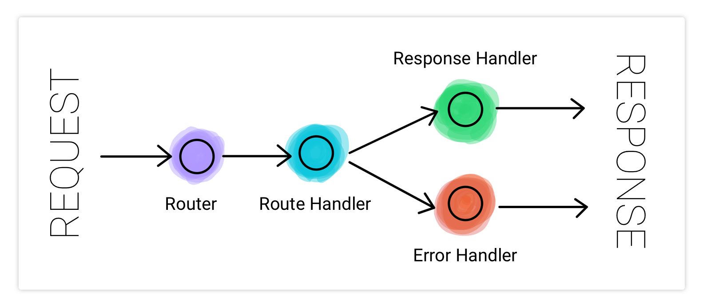
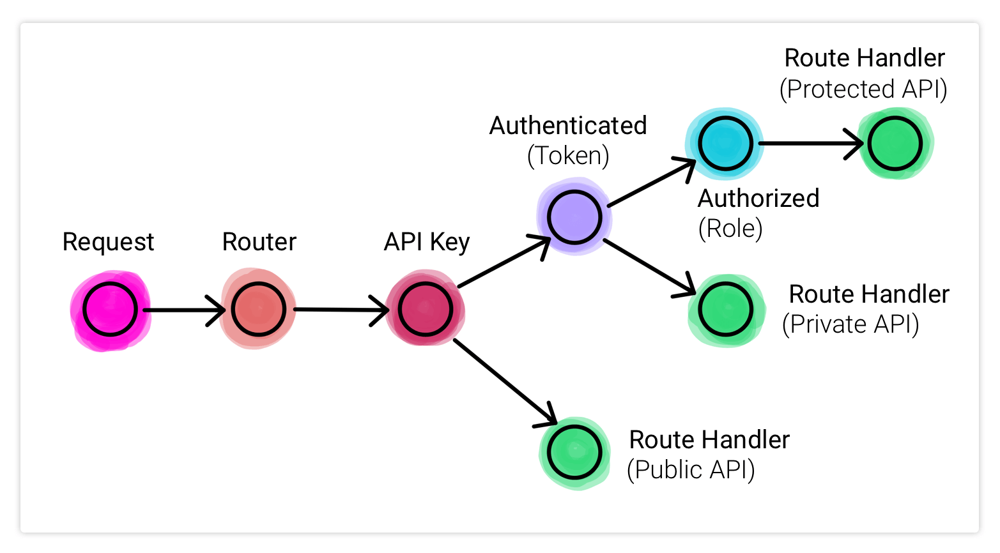

# Node.js Best Practices

Continuing on the thought process of writing well-structured and error-resilient code, let's now come to best practices specific to code written in Node.js. A lot of this comes down to the readability of our code. As developers, we are not just writing code, but also reading others' code and having our code read by other developers. The objectives of this lesson are:

1. Familiarizing ourselves with good project structure and coding best practices
2. Reiterating best practices related to architecture covered in previous lessons

## Best practices for Node.js project setup

A good Node.js project structure helps us to:

1. Write clean and readable code
2. Write reusable pieces of code across our application
3. Avoid repetition
4. Add new features without disrupting existing code

We found a comprehensive list of Node.js project best practices shared by LogRocket.

### 1. Create a folder structure for your project

When starting a new project, think about your folder structure in detail. How should the files be organized and separated? Will it be easy for all team members to understand the folder structure? Don't be that person who has a messy room but refuses to organize saying that they know exactly where each item is. That may work for a single person's room, but not a shared codebase at the workplace. Also when it comes to personal projects, future you will be thankful if you start with a good folder structure.

### 2. Separate business logic and API routes

In some of the starting assignments, we would write the business logic in the same file where we set up API routes. While this was alright for small beginner projects, for large projects following this approach can lead to creating a monolithic mammoth of code that can eventually be difficult to manage. This is why we started using separate folders like `routes`, `controllers`, `services`, `utils`, etc. in later assignments to practice separation of concerns.

### 3. Use a service layer

In medium to large projects, it is best to create 3 levels of managing our code. Of course, we start with our `app` setup like we've done in all our Express applications so far. Then we have `routes` and/or `controllers` for our API endpoints. Now here comes the third layer - `services`. This is the place where all our business logic should live. It's a collection of files implementing our app's core logic. The only part that may be ignored in this layer is the one that accesses the database; that should be managed by the data access layer. Consider this as another folder such as `db`.

### 4. Use a config folder to organize configuration files

This can include files such as `index.js` and `server.js` to configure and initialize our server. This can also include other `.js` or `.json` files for configuration constants which are fixed values that can be used across the code files. However, this should not include any dynamic and/or sensitive data. As that is better provided through environment variables, which can be a `.env` file.

### 5. Establish a scripts folder for long npm scripts

Let's say that the initial database startup requires loading some initial data or checking the integrity of the data, which can be done using a bash script. Such an operation can be included in the folder structure as `scripts/startupDB.sh`.

### 6. Use another layer for third-party services calls

This can be a folder called `utils` or `integrations` where each file includes wrapper functions that make calls to third-party services. For example, in assignments where we used Nodemailer, we wrote a file called `email.js` with a function `sendEmail` that handles providing dynamic inputs to the Nodemailer function call and managing the success and error response cases. A separate layer for such calls helps to easily upgrade third-party packages, as you only need to modify the code in one place and not worry about the multiple parts of the codebase using it.

### 7. Comment your code

Did you notice we have been writing comments in the solution code for assignments? Although our purpose is for education, it is still useful to write explanatory comments in production codebases. Well-written comments will become extremely useful for your fellow developers and to your future self, all of whom will be wondering why exactly you did something six months after you first wrote it.

### 8. Keep an eye on your file sizes

Files that are too long are extremely hard to manage and maintain. Always keep an eye on your file length, and if they become too long, try to split them into modules packed in a folder as files that are related together.

### 9. Use gzip compression

The server can use gzip compression to reduce file sizes before sending them to a web browser. This will reduce latency and lag. In Express.js, this can be done [using a middleware](https://expressjs.com/en/resources/middleware/compression.html).

### 10. Use promises and async/await efficiently

Since most code written in Node.js is asynchronous, promises and async/await calls must be used more than callbacks to avoid [callback hell](https://www.geeksforgeeks.org/what-is-callback-hell-in-node-js/) situations. We should always not only use promises in our applications but also make use of their error handling support provided by the catch keyword. This means using both `.then` and `.catch` when it comes to promises, and wrapping our `await` function calls in a try-catch block. This does not mean we won't use callbacks at all because we have been using them in event listener type functions or passed to array and object functions like `map` and `filter`. Take a look at [this Stackoverflow thread](https://stackoverflow.com/questions/45041462/node-js-when-to-use-promises-vs-callbacks) for when to use promises vs callbacks.

Other than the above, here are some best practices reiterated from previous readings:

- Use design patterns efficiently
- Conduct unit testing
- Use a linter and a code style guide

## Best practices related to Node.js architecture

We've already covered many important best practices in the above section but now we'll focus more on architecture and production-ready best practices using another comprehensive list by AfterAcademy.

### 1. Type Safety

Quite often there can be unexpected bugs simply because of calling a function with incorrect parameters or mismanaging types. This is where TypeScript comes in which allows you to apply static type checking on your JavaScript code and validate it. We will be learning to use TypeScript in the final module of this curriculum, but [here](https://www.youtube.com/watch?v=zQnBQ4tB3ZA&ab_channel=Fireship) is a quick 100-second video to get introduced to TypeScript. Many companies these days are adopting TypeScript to ensure error-free application code.

### 2. Separation of Concerns and Feature Encapsulation

The concept of separation of concerns is just a reiteration of the different layers we mentioned in the previous section, which helps to keep our project structure modular and follow a plug-and-play approach instead of keeping a bunch of functionality in a single monolithic structure. There is another similar approach to structuring project files in which we group the files related to a single feature together. For example, everything related to Profile or Dashboard can be in their dedicated folders.

### 3. Response handling and Error handling

It is good practice to write dedicated error and response handler functions or classes that can be reused throughout the codebase. This also ensures following a consistent error messaging and response structure approach for our APIs and is a continuation of writing modular code managed and modified from a single place. The handling of the request-response flow following this approach can be visualized as below:

### 4. Simple deployability

We will look into deployment in detail in the next module of the curriculum, however, you have seen this in practice using Docker and docker-compose files which help us spin off our application using containerized services such as a database and an application. Using easily maintainable configuration files such as these helps to keep the deployment process quick and simple.

### 5. API Security

This is a reiteration of everything we learned in the Authentication and Security module. A good architecture includes the adoption of good security practices, sometimes it is the most important consideration in architectural decisions depending on the business needs. Always keep in mind these top rules for security:

- Load sensitive configurations using environment variables and manage secrets securely
- Use token-based or session-based authentication ensuring encryption of passwords and/or retrieving access tokens from third-party authentication services
- Use role-based authorization to control access levels on resources
- Consider mandating API keys even for public API endpoints
- Consider setting up throttling and rate-limiting on your APIs

And finally here are some other good practices which we will learn about in detail in upcoming lessons:

- Implement microservices for specific functionalities for example managing notifications (push notifications, email, SMS, Whatsapp, etc.)
- Setup error logging, request-response, and application logging
- Setup cron jobs
- Setup server-side cache
- Use application performance monitoring tools

This can also be a good time to revisit the lesson on API best practices in module 1. We will now learn a little bit more about performance optimization practices in the next module.

---

## References

- https://blog.logrocket.com/the-perfect-architecture-flow-for-your-next-node-js-project/
- https://afteracademy.com/blog/design-node-js-backend-architecture-like-a-pro
- https://www.freecodecamp.org/news/have-an-idea-want-to-build-a-product-from-scratch-heres-a-checklist-of-things-you-should-go-through-in-your-backend-software-architecture/
