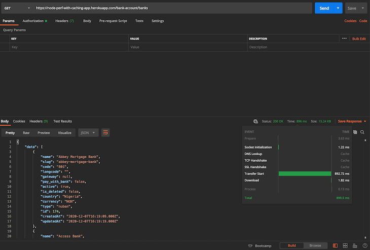
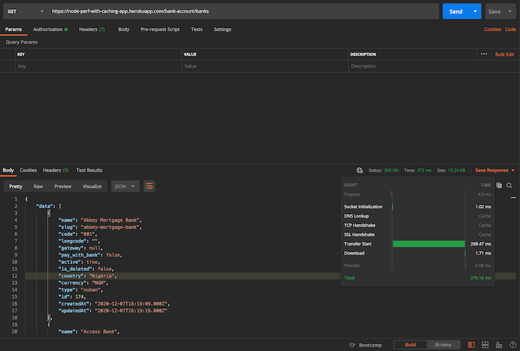

# Caching with Redis

Let's start with a common and highly beneficial use case of Redis - Caching. The objectives of this lesson are:

1. Understanding the need for caching
2. Exploring a cache setup example in Node applications

## What is caching and why do we need it?

While working with databases on your applications, you might have noticed that there are frequent operations requesting the same data set. Although the data can be read from our persistent database as many times as required, in production with high traffic this might mean low performance for our end users.

Caching is generally recommended for cases in which the state of the data at a particular point in the app rarely changes. Think lists of products, country calling codes, or store locations. Consider this example, we needed to fetch a list of banks from an external API. The most efficient method is to make that API call once and store the response in a cache. This means that, subsequently, we won't need to make that same API call over the internet; rather, we can just retrieve the data from our cache since we wouldn't expect it to suddenly change. Caching the data or the API response at that layer improves our app performance by a significant degree.

With caching systems, data retrieval processes are already optimized since data is stored in memory. This is in contrast to the on-disk storage mechanisms found in most traditional databases, wherein reads and writes (in terms of queries) are not as fast when compared to an in-memory storage system. In-memory databases are generally used by applications that manage a large amount of data and depend on rapid response time. With that in mind, we can sum up the two major benefits of in-memory databases:

- Fewer CPU round trips/processes, leading to faster transactions
- Faster reads/writes, ensuring multi-user concurrency

On the flip side, in-memory databases are more volatile than traditional databases since we can easily lose data if, for example, the RAM crashes. Traditional databases perform great in this regard because data can still be restored from the disks in the event of any issues.

## Caching with Redis: How Redis influences app performance

Redis is a preferred caching solution because its entire database is stored in memory, and it uses a disk database for data persistence. Since Redis is an in-memory database, its data access operations are faster than any other disk-based database, which makes Redis the perfect choice for caching.

Its key-value data storage system is another plus because it makes storage and retrieval much simpler. Using Redis, we can store and retrieve data in the cache using the SET and GET methods, respectively. Besides that, Redis also works with complex data types like lists, sets, strings, hashes, bitmaps, and so on.

The process of caching with Redis is quite simple. When we receive a user request to a route that has caching enabled, we first check whether the requested data is already stored in the cache. If it is, we can quickly retrieve the data from the Redis cache and send the response back.

If the data is not stored in the cache, however — which we call a "cache miss" — we have to first retrieve the data from the database or from an external API call and send it to the client. We also make sure to store the retrieved data in the cache so that the next time the same request is made, we can simply send the cached data back to the user.

Now that we have a clear idea of what we are going to do, let's get started with the implementation.

## Creating a custom cache service in Node.js

In this section, we'll look at how to use Redis to create a simple cache for a Node.js application, then inspect how it impacts its performance. We'll go with the banks' example mentioned previously above. The steps are highlighted below:

1. Spin up a simple Node.js application
2. Write a reusable custom Redis implementation/cache service
3. Show how using Redis to cache data from an external API call can help improve the performance of our app

Creating a simple custom cache service will allow us to:

1. Create a reusable service that we could employ in multiple parts of our app
2. Normalize the cache API and add more methods our app will need as it grows
3. Easily replace the cache module we chose with another one (if needed)

First, we'll quickly bootstrap a simple Node.js application. We can do so by running `npm init` inside a new folder for our app, which creates a `package.json` file for us:

```json
{
  "name": "caching_redis_node.js",
  "version": "1.0.0",
  "description": "A sample app to showcase Redis caching",
  "main": "app.js",
  "scripts": {
    "start": "node app.js"
  },
  "keywords": [
    "Node.js",
    "Redis",
    "Performance",
    "Cache",
    "Caching",
    "JavaScript",
    "Backend"
  ],
  "author": "Alexander Nnakwue",
  "license": "MIT",
  "dependencies": {
    "@hapi/joi": "^15.0.1",
    "axios": "^0.21.1",
    "body-parser": "^1.19.0",
    "dotenv": "^8.2.0",
    "express": "^4.17.1",
    "global": "^4.4.0",
    "redis": "^3.0.2",
    "util": "^0.12.3"
  }
}
```

Next, let’s set up a simple Express server in the root of our project directory as `app.js`.

```js
require("dotenv").config();
const express = require("express");
const bodyParser = require("body-parser");
const config = require("./config");
const routes = require("./app/routes");

const app = express();
require("./cacheManager");

app.use(bodyParser.json());
// parse application/x-www-form-urlencoded
app.use(bodyParser.urlencoded({ extended: true }));

// parse application/json
app.use(bodyParser.json());
app.get("/", (req, res) => {
  res.status(200).send("Welcome to the Node.js Caching with Redis");
});
// add routes here
routes(app);

// catch 404 and forward to error handler
app.use((req, res, next) => {
  const err = new Error("Not Found");
  err.status = 404;
  res.send("Route not found");
  next(err);
});
app.listen(process.env.PORT || config.port, () => {
  console.log(`${config.name} listening on port ${config.port}!`);
});

module.exports = app;
```

In the server file above, we can see that we are importing a `cacheManager` file, which basically handles everything that has to do with asynchronous caching in Redis. Let's see the contents of that file:

```js
"use strict";

const redis = require("redis");
const { promisify } = require("util");
const config = require("./config");
const redisClient = redis.createClient({
  host: config.redis_host,
  port: config.redis_port,
});
const password = config.redis_password || null;
if (password && password != "null") {
  redisClient.auth(password, (err, res) => {
    console.log("res", res);
    console.log("err", err);
  });
}
try {
  redisClient.getAsync = promisify(redisClient.get).bind(redisClient);
  redisClient.setAsync = promisify(redisClient.set).bind(redisClient);
  redisClient.lpushAsync = promisify(redisClient.lpush).bind(redisClient);
  redisClient.lrangeAsync = promisify(redisClient.lrange).bind(redisClient);
  redisClient.llenAsync = promisify(redisClient.llen).bind(redisClient);
  redisClient.lremAsync = promisify(redisClient.lrem).bind(redisClient);
  redisClient.lsetAsync = promisify(redisClient.lset).bind(redisClient);
  redisClient.hmsetAsync = promisify(redisClient.hmset).bind(redisClient);
  redisClient.hmgetAsync = promisify(redisClient.hmget).bind(redisClient);
  redisClient.clear = promisify(redisClient.del).bind(redisClient);
} catch (e) {
  console.log("redis error", e);
}

redisClient.on("connected", function () {
  console.log("Redis is connected");
});
redisClient.on("error", function (err) {
  console.log("Redis error.", err);
});
setInterval(function () {
  console.log("Keeping alive - Node.js Caching with Redis");
  redisClient.set("ping", "pong");
}, 1000 * 60 * 4);

global.cache = redisClient;
module.exports = redisClient;
```

We can see from the file above that we have created a Redis client and connected it to a Redis cluster with the `config` available in our `env` variable. Also, we are setting a keep-alive script that runs every four minutes.

The config file that holds all our env variables is shown below:

```js
require("dotenv").config();
const { env } = process;
module.exports = {
  name: env.APP_NAME,
  baseUrl: env.APP_BASE_URL,
  port: env.PORT,
  redis_host: env.REDIS_HOST,
  redis_port: env.REDIS_PORT,
  redis_password: env.REDIS_PASSWORD,
  paystack_secret_key: env.PAYSTACK_SECRET_KEY,
};
```

Now that we are done with all the setup, we can proceed to the most important part of this exercise: the actual business logic that allows us to apply Redis caching strategies.

In our project folder we'll have a file called `paystackRepository.js` which calls the [Paystack API](https://paystack.com/docs/) and fetches a lists of banks and resolves bank account numbers.

```js
const axios = require("axios");
const config = require("../../config");
const { handleAxiosError } = require("../../helpers");
const _axios = axios.create({
  baseURL: "https://api.paystack.co",
  headers: {
    Authorization: `Bearer ${config.paystack_secret_key}`,
  },
});

exports.banks = async () => {
  try {
    return {
      data: (await _axios.get(`bank`)).data.data,
    };
  } catch (error) {
    console.log("An Error Occurred", error, handleAxiosError(error));
    return { error: error.message };
  }
};

exports.resolveAccountNumber = async (bankCode, accountNumber) => {
  try {
    return {
      data: (
        await _axios.get(`bank/resolve`, {
          params: {
            bank_code: bankCode,
            account_number: accountNumber,
          },
        })
      ).data.data,
    };
  } catch (error) {
    console.log("An Error Occurred", error, handleAxiosError(error));
    return { error: error.message };
  }
};
```

From the file above, we can see that we are using Axios with the `PAYSTACK_SECRET_KEY` header stored in our `env` variable to make HTTP requests to Paystack’s API.

Now let's have a look at the `BankService.js` file. It calls the `paystackRepository.js` file to fetch a list of banks and resolve bank account numbers, as we reviewed above. We are also caching the results after making the first API call to eliminate the need for subsequent calls.

```js
"use strict";

const paystackRepository = require("../paystack/PaystackRepository");

exports.fetchAllBanks = async () => {
  // incase we are calling this endpoint a second time, we do not need to make a new API request
  let banks = await cache.getAsync("bank-list");
  console.log("Data from cache", banks);
  if (banks) return { data: JSON.parse(banks) };
  const { error, data } = await paystackRepository.banks();
  if (error) return { error };
  // Store the bank list in a cache, since it rarely changes
  let cacheResponse = await cache.setAsync("bank-list", JSON.stringify(data));
  console.log("Cache", cacheResponse);
  return { data };
};

exports.resolveAccount = async (bankName, accountNumber) => {
  // Relying on the cached data is faster, as it rarely changes
  let banks = JSON.parse(await cache.getAsync("bank-list"));

  console.log(banks, "banks");
  // Incase the data is not stored in the cache yet (but we expect it to be), make an API call to get bank lists
  if (!banks) {
    const { error, data } = await paystackRepository.banks();
    if (error) return { error };
    banks = data;
  }
  const bank = banks.find((bank) => {
    return bank.name == bankName;
  });
  if (!bank) return { error: "Bank Not Found" };
  console.log(bank.code);
  const { error, data } = await paystackRepository.resolveAccountNumber(
    bank.code,
    accountNumber
  );
  if (error) return { error };
  return {
    data: {
      accountNumber,
      bankName,
      accountName: data.account_name,
    },
  };
};

exports.resolveAccountPerfTest = async (bankName, accountNumber) => {
  // if there were no cache mechanism in place we needed to go fetch the bank lists compulsorily at every API call
  let banks;
  if (bankName && accountNumber) {
    const { error, data } = await paystackRepository.banks();
    if (error) return { error };
    banks = data;
  }

  const bank = banks.find((bank) => {
    return bank.name == bankName;
  });
  if (!bank) return { error: "Bank Not Found" };
  const { error, data } = await paystackRepository.resolveAccountNumber(
    bank.code,
    accountNumber
  );
  if (error) return { error };
  return {
    data: {
      accountNumber,
      bankName,
      accountName: data.account_name,
    },
  };
};
```

For the `fetchAllBanks` service, we are getting the bank list from Redis, but not without first saving the results to the Redis cache upon making the initial API request. Additionally, we can see that we have duplicated the `resolveAccount` method and removed the Redis implementation on the second method named `resolveAccountPerfTest`.

Next, we can navigate to the controller file, wherein we actually use these methods:

```js
"use strict";
const bankService = require("./BankService");
const { sendErrorResponse, sendResponse } = require("../../helpers");

exports.fetchAllBanks = async (req, res, next) => {
  const { error, data } = await bankService.fetchAllBanks();
  if (error) return sendErrorResponse({ res, message: error });
  return sendResponse({ res, responseBody: data });
};

exports.resolveAccountNumber = async (req, res) => {
  const { bankName, accountNumber } = req.body;
  const { error, data } = await bankService.resolveAccount(
    bankName,
    accountNumber
  );
  if (error) return sendErrorResponse({ res, message: error });
  return sendResponse({ res, responseBody: data });
};

exports.resolveAccountPerfTest = async (req, res) => {
  const { bankName, accountNumber } = req.body;
  const { error, data } = await bankService.resolveAccountPerfTest(
    bankName,
    accountNumber
  );
  if (error) return sendErrorResponse({ res, message: error });
  return sendResponse({ res, responseBody: data });
};
```

Finally, before we test our implementation, we can take a peek at the routes file, located in the routes folder:

```js
"use strict";

const router = require("express").Router();
const accountValidator = require("../bankAccount/BankAccountValidator");
const accountController = require("../bankAccount/BankAccountController");

router.get("/banks", accountController.fetchAllBanks);
router.post(
  "/resolve",
  accountValidator.resolveAccount,
  accountController.resolveAccountNumber
);
// TEST ROUTE TO SIMULATE PERFORMANCE METRICS BASED ON CACHING OUR ROUTES
router.post(
  "/resolve/perf/test",
  accountValidator.resolveAccount,
  accountController.resolveAccountPerfTest
);

module.exports = router;
```

To understand the implementation details of other imported files, refer to the [source code on GitHub](https://github.com/firebase007/Node.js_performance_with_caching). Also, note that the app has been deployed on Heroku so as to test the implementation in a simulated live environment. The base URL is https://node-perf-with-caching-app.herokuapp.com.

We can use the Network tab on our browser console to monitor the time taken for a request the first time when there's no data in the cache and then a second time when data has been cached.



As you can see, when we request the banks' data for the first time, since it hasn't been cached yet our API talks to the Paystack API to fetch all banks. So, the request takes about 890ms. But it also saves the fetched data in cache for subsequent requests.



In the second request, this time our API knows that the data exists in the cache so it reads it directly from there. As a result, the response time is reduced to about 270 ms.

## Conclusion

Caching is a near-mandatory operation for any data-intensive application. It improves app response time and even reduces costs associated with bandwidth and data volumes. It helps to minimize expensive database operations, third-party API calls, and server-to-server requests by saving a copy of previous request results locally on the server.

In some cases, we might need to delegate caching to another application or key-value storage system to allow us to store and use data as we need it. Redis is one such option that we can also use for caching.

Here are some more code examples for implementing Redis-based caching in Node.js.

- [Caching recipes](https://www.section.io/engineering-education/implementing-caching-in-nodejs-using-redis/)
- [Caching programming jobs available in different locations in the world](https://livecodestream.dev/post/beginners-guide-to-redis-and-caching-with-nodejs/)

---

## References

- https://blog.logrocket.com/caching-node-js-optimizing-app-performance-redis/
