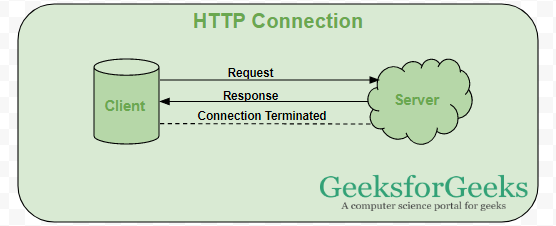
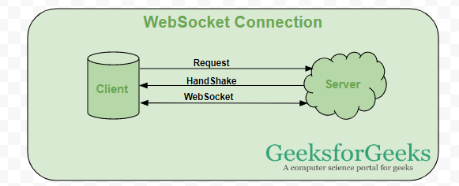
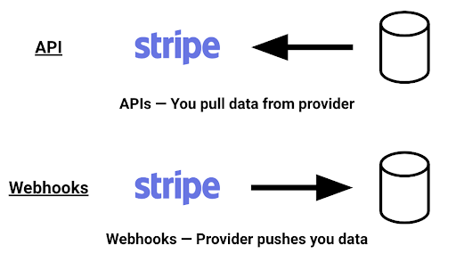
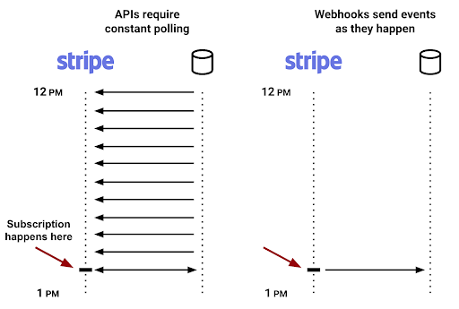

# Websockets

We've looked into many architectural concepts such as design patterns, best practices for performance and reliability, and usage of Redis for features like caching, job queues, and session stores, but all are still in the realm of REST APIs. Let us now look a bit beyond REST and explore other architectural choices in backend applications, starting with an interesting concept called WebSockets. The objectives of this lesson are:

1. Getting familiar with the concept of WebSockets
2. Comparing WebSockets with HTTP and REST
3. Exploring the use cases of WebSockets
4. Getting familiar with the concept of webhooks

## What are WebSockets?

The WebSocket protocol, described in the specification [RFC 6455](https://datatracker.ietf.org/doc/html/rfc6455) provides a way to exchange data between browser and server via a persistent connection. The data can be passed in both directions as "packets", without breaking the connection and additional HTTP requests. WebSocket is especially great for services that require continuous data exchange, e.g. online games, real-time trading systems, and so on.

The web has traveled a long way to support full-duplex (or two-way) communication between a client and server. This is the prime intention of the WebSocket protocol: to provide persistent real-time communication between the client and the server over a single TCP socket connection. The WebSocket protocol has only two agendas: 1) to open up a handshake, and 2) to help the data transfer. Once the server and client both have their handshakes in, they can send data to each other with less overhead at will.

WebSocket communication takes place over a single TCP socket using either WS (port 80) or WSS (port 443) protocol. Almost every browser provides admirable support for WebSockets as per [Can I Use](https://caniuse.com/#feat=websockets).

## How is WebSocket different from HTTP?

HTTP and WebSocket both are communication protocols used in client-server communication.

**HTTP protocol**: HTTP is unidirectional where the client sends the request and the server sends the response. Let's take an example when a user sends a request to the server, this request goes in the form of HTTP or HTTPS, after receiving the request the server sends the response to the client, each request is associated with a corresponding response, after sending the response the connection gets closed, each HTTP or HTTPS request establishes a new connection to the server every time and after getting the response the connection gets terminated by itself.

So HTTP is a stateless protocol that runs on top of TCP which is a connection-oriented protocol it guarantees the delivery of data packet transfer using the three-way handshaking methods and re-transmits the lost packets.



**WebSocket**: WebSocket is bidirectional, a full-duplex protocol that is used in the same scenario of client-server communication. However, unlike HTTP, it starts with `ws://` or `wss://`.

It is a stateful protocol, which means the connection between client and server will keep alive until it is terminated by either party (client or server). After closing the connection by either of the client and server, the connection is terminated from both ends.

Let's take an example of client-server communication, the client is a web browser and we have a server, whenever we initiate the connection between client and server, the client-server makes the handshaking and decides to create a new connection and this connection will be kept alive until terminated by any of them. When the connection is established and alive the communication takes place using the same connection channel until it is terminated. In a way, you can say that the client and server are both actively listening to each other while the WebSocket connection is open.



## How is WebSocket different than HTTP polling, HTTP streaming, and server-sent events?

Historically, creating web apps that needed real-time data (like gaming or chat apps) required an abuse of HTTP protocol to establish bidirectional data transfer. There were multiple methods used to achieve real-time capabilities, but none of them were as efficient as WebSockets.

### HTTP polling

The very first attempt to solve the problem was by polling the server at regular intervals. The HTTP long polling lifecycle is as follows:

1. The client sends out a request and keeps waiting for a response.
2. The server defers its response until there's a change, update, or timeout. The request stayed "hanging" until the server had something to return to the client.
3. When there's some change or update on the server end, it sends a response back to the client.
4. The client sends a new long-poll request to listen to the next set of changes.
5. There were a lot of loopholes in long-polling — header overhead, latency, timeouts, caching, and so on.

### HTTP streaming

This mechanism saved the pain of network latency because the initial request is kept open indefinitely. The request is never terminated, even after the server pushes the data. The first three lifecycle methods of HTTP streaming are the same in HTTP polling. When the response is sent back to the client, however, the request is never terminated; the server keeps the connection open and sends new updates whenever there's a change.

### Server-sent events (SSE)

With SSE, the server pushes data to the client. A chat or gaming application cannot completely rely on SSE. The perfect use case for SSE would be, e.g., the Facebook News Feed: whenever new posts come in, the server pushes them to the timeline. SSE is sent over traditional HTTP and has restrictions on the number of open connections.

These methods were not just inefficient, the code that went into them also made developers tired.

You can read in further detail about these comparisons in [this article](https://medium.com/platform-engineer/web-api-design-35df8167460).

## How is WebSocket different from REST?

This can be understood from an [IoT](https://en.wikipedia.org/wiki/Internet_of_things) perspective, an area where WebSocket has a lot of use cases. A web service can either be implemented using REST principles or using WebSocket Protocol.

1. REST is a stateless protocol and will not store data across requests but WebSocket is a stateful protocol that can store data throughout the communication.
2. REST is uni-directional and only the client or server can communicate at a time while WebSocket is bi-directional allowing messages to be sent and received by both client and server.
3. REST is a request-response model and WebSocket is a full-duplex model.
4. HTTP communication uses headers while WebSockets are more suitable for real-time communication without any overhead.
5. A new TCP connection is set up for every REST communication while WebSocket uses a single alive TCP connection.
6. REST supports both horizontal and vertical scaling as in adding many resources and users but WebSocket is suitable only for vertical scaling which is adding resources.
7. REST depends on HTTP methods to retrieve data while WebSocket depends on the IP address and port to retrieve data.
8. REST is slower than WebSocket and that's why not so suitable for real-time communication with instant feedback.

## Why you should use WebSockets

WebSockets are designed to supersede the existing bidirectional communication technologies. The existing methods described above are neither reliable nor efficient when it comes to full-duplex real-time communications. WebSockets are similar to SSE but also triumphs in taking messages back from the client to the server. Connection restrictions are no longer an issue since data is served over a single TCP socket connection. Some practical usage examples of WebSocket are:

1. **Real-time web application**: It uses WebSockets to show the data at the client end, which is continuously being sent by the backend server. Data is continuously pushed/transmitted into the same connection which is already open, that is why WebSocket is faster and improves the application performance. For example, in a trading website or cryptocurrency trading, for displaying the price fluctuation and movement, data is continuously pushed by the backend server to the client end by using a WebSocket channel.
2. **Gaming application**: In a gaming application, you might have noticed that data is continuously received by the server, and it takes effect on the screen without refreshing the UI. The UI gets automatically refreshed without even establishing the new connection. So WebSockets enable that seamless real-time gaming experience.
3. **Chat application**: Chat applications use WebSocket to establish the connection only once for exchange, publishing, and broadcasting the message among the subscribers. It reuses the same WebSocket connection, for sending and receiving the message and for one-to-one message transfer.

And now maybe WebSockets will be helpful in developing a metaverse? Maybe that's better covered in a separate curriculum for Web 3.0.

**When not to use WebSocket**: WebSocket can be used if we want any real-time updated or continuous streams of data that are being transmitted over the network. If we want to fetch old data or want to get the data only once to process it with an application we should go with the HTTP protocol, old data which is not required very frequently or fetched only once can be queried by the simple HTTP request, so in this scenario, it's better not use WebSocket.

Note: RESTful web services are sufficient to get the data from the server if we are loading the data only once.

You can read more about WebSocket API in the [MDN docs](https://developer.mozilla.org/en-US/docs/Web/API/WebSockets_API). Take a look [here](https://www.twilio.com/docs/glossary/what-are-websockets) at how Twilio makes use of WebSockets. Follow a simple JavaScript code example of WebSockets [here](https://javascript.info/websocket).

After this reading, we'll get some hands-on practice with WebSockets by building a chat application using [socket.io](https://socket.io/) library in the upcoming assignment. You can take a look at [this tutorial](https://www.cometchat.com/tutorials/how-to-build-a-chat-app-with-websockets-and-node-js) which has a detailed code walkthrough for building a WebSockets-based chat application.

## Have you also heard of Webhooks?

The name might sound quite similar to WebSockets, however, they are not necessarily related. As a backend developer, you may often find yourself integrating with third-party APIs and services. Your API can integrate with another API by making requests. But sometimes you'll find the use of webhooks instead. Let's take a closer look at this and how it is beneficial for our backend applications.



Webhooks enable services like Stripe, GitHub, or Google to push data to you, instead of you having to pull data from them.
When some event occurs (e.g. someone buys something from your store), the service sends you an HTTP request with data about that event. You don't have to run a script to poll the API for new events; they'll tell you when they happen, as soon as they happen.



GitHub for example can send your API a request each time someone opens a new issue in your repo. They'll tell you when a new branch is created, or even when a repo is starred. GitHub calls these as events.

If a service supports webhooks, you can automate almost anything where you need to take some action in response to some event. For example, you can send yourself an email or Slack message when an event occurs in your service, or trigger an action in another service (e.g. update Salesforce each time you get a Stripe subscription).

If you want to analyze data from a service, you can send webhooks directly to a database or data warehouse as a record of every event. This lets you build charts or run SQL queries to ask questions you can't answer using the service's built-in dashboards. You can also join these events with data from your own or other apps.

### So how do you use webhooks in your code?

Webhooks are just HTTP requests. Any service that can process HTTP requests can process webhooks.

Let's say you want to use a webhook from GitHub such that your API receives a request every time one of your assignment repos gets a code review. Of course, you would first have to go through the [GitHub events documentation](https://docs.github.com/en/developers/webhooks-and-events/webhooks/about-webhooks). Once you have understood the event you would like to be notified of, you must create an API endpoint on your server that can receive the event - this will almost always be a POST request.

```js
app.post("/code-review-received", function (req, res) {
  // you receive the webhook payload in the request
  // and then you can process the payload as per your needs
});
```

Once you have created this endpoint, you can configure it in GitHub events settings. That is to inform GitHub where to send the event information, `https://your-api-base-url/code-review-received`. For security purposes, you may have to setup some API keys/secrets to ensure that only GitHub can call your payload endpoint. And then you're all set. Whenever the event takes place, the service hooks to (calls) your API with data about the event. And with the data received from the event, your API can perform further actions.

To wrap it up, usually, you would make requests to a third-party service to receive information. When this information is about an event, this method requires polling requests to keep checking if the event occurred or not. Webhooks reverse the scenario, such that the service informs your server only and exactly when the event occurs.

## Conclusion

There is so much more to backend development than simply REST. This was just a glimpse into some interesting topics, but it goes to say that we must always keep our eyes and ears open to learn the different methods of systems integration and services talking to each other. We will get a chance to practice WebSockets in an assignment. And maybe you can think of integrating webhooks in a personal project, or your capstone project. Explore some third-party services that provide webhooks, read their documentation, and understand how it works to enhance your learning.

---

## References

- https://javascript.info/websocket
- https://blog.logrocket.com/websockets-tutorial-how-to-go-real-time-with-node-and-react-8e4693fbf843/
- https://www.geeksforgeeks.org/what-is-web-socket-and-how-it-is-different-from-the-http/
- https://www.geeksforgeeks.org/difference-between-rest-api-and-web-socket-api/
- https://medium.com/@dylan.sather/processing-webhooks-with-node-js-and-pipedream-63fe205cb0f8
- https://blog.logrocket.com/receive-webhooks-python-flask-or-django/
