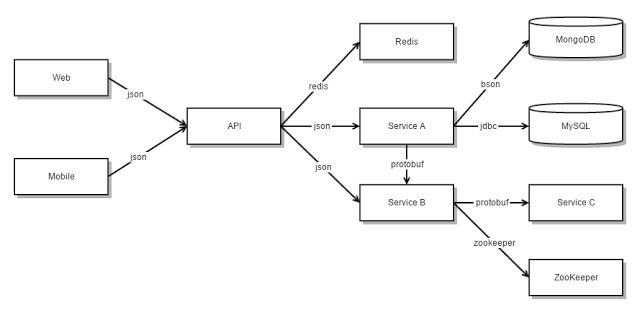

# Microservices

Have you heard of this architectural term in your learning journey so far? It is exactly what the name suggests - small services that work together. This is a very popular architecture choice in the industry today to provide highly available yet easily maintainable web services. The objectives of this lesson are:

1. Developing a basic understanding of microservices architecture
2. Understanding the benefits and best practices of microservices architecture
3. Getting familiar with microservices architecture in practice with Node.js

## Monolithic vs Microservices Architecture

We have learned about building modular applications such as the MVC architecture where we organize our code into models, views, and controllers. We enable the separation of concerns between the handling of requests and responses, the core business logic, database access and manipulation, and integration with other services. This makes for a logically modular architecture, but in the end, the application is packaged and deployed as a monolith. As per Wikipedia, a monolithic application describes a single-tiered software application in which the user interface and data access code are combined into a single program from a single platform. A monolithic application is self-contained and independent from other computing applications.

### Pros and Cons of Monolithic Architecture

This architecture style has been followed for years and has its own benefits.

1. Simple to develop as all your code is maintained and built in one place.
2. Simple to test with unit tests or simple end-to-end integration tests.
3. Simple to deploy by building the application package and moving it to a remote server.
4. Simple to scale horizontally by running multiple copies behind a load balancer.

In the early stages of any project, it works well, and basically, most of the big and successful applications which exist today were started as a monolith. But that brings us to its major drawbacks.

1. This simple approach has a limitation in size and complexity.
2. The application becomes too large and complex to fully understand and make changes fast and correctly.
3. The size of the application can slow down the start-up time.
4. The entire application has to be redeployed on each update.
5. Impact of a change is usually not very well understood which leads to extensive manual testing.
6. Continuous deployment is difficult.
7. Monolithic applications can also be difficult to scale when different modules have conflicting resource requirements.
8. Another problem with monolithic applications is reliability. Bugs in any module can potentially bring down the entire process. Moreover, since all instances of the application are identical, that bug will impact the availability of the entire application.
9. Monolithic applications have a barrier to adopting new technologies. Since changes in frameworks or languages will affect an entire application it is extremely expensive in both time and cost.

### Microservices Architecture

Microservices architecture is an approach in which a single application is composed of many loosely coupled and independently deployable smaller services. These services typically

- have their own technology stack, inclusive of the database and data management model;
- communicate with one another over a combination of REST APIs, event streaming, and message brokers; and
- are organized by business capability, with the line separating services often referred to as a bounded context.

The idea is to split your application into a set of smaller, interconnected services instead of building a single monolithic application. Each microservice is a small application that has its own hexagonal architecture consisting of business logic along with various adapters. Some microservices would expose a REST, RPC, or message-based API and most services consume APIs provided by other services. Other microservices might implement a web UI.

Theis architecture pattern significantly impacts the relationship between the application and the database. Instead of sharing a single database schema with other services, each service has its own database schema. On the one hand, this approach is at odds with the idea of an enterprise-wide data model. Also, it often results in duplication of some data. However, having a database schema per service is essential if you want to benefit from microservices because it ensures loose coupling. Each of the services has its own database. Moreover, a service can use a type of database that is best suited to its needs, the so-called polyglot persistence architecture.

Some APIs are also exposed to mobile, desktop, and web apps. The apps don't, however, have direct access to the backend services. Instead, communication is mediated by an intermediary known as an API Gateway. The API Gateway is responsible for tasks such as load balancing, caching, access control, API metering, and monitoring.

The two main characteristics of microservices are:

1. **Autonomous**: Each component service in a microservices architecture can be developed, deployed, operated, and scaled without affecting the functioning of other services. Services do not need to share any of their code or implementation with other services. Any communication between individual components happens via well-defined APIs.
2. **Specialized**: Each service is designed for a set of capabilities and focuses on solving a specific problem. If developers contribute more code to the service over time and the service becomes complex, it can be broken into smaller services.

Most large-scale websites including Netflix and Amazon have evolved from a monolithic architecture to a microservice architecture. Netflix, which is a very popular video streaming service that's responsible for up to 30% of Internet traffic, has a large-scale, service-oriented architecture. They handle over a billion calls per day to their video streaming API from over 800 different kinds of devices. Each API call fans out to an average of six calls to backend services. Amazon.com originally had a two-tier architecture. In order to scale they migrated to a service-oriented architecture consisting of hundreds of backend services. Several applications call these services including the applications that implement the Amazon.com website and the web service API. The Amazon.com website application calls 100-150 services to get the data that is used to build a web page.

There are [numerous other examples](https://microservices.io/articles/whoisusingmicroservices.html) of companies using the microservice architecture.

### Pros and Cons of Microservices Architecture

Microservices are popular with developers as well as project managers and leaders. Generally, architectural enthusiasm is shared only by software development teams, but microservices architecture owes its popularity to the fact that it better reflects the way many business leaders want to structure and run their teams and development processes. Microservices are an architectural model that better facilitates a desired operational model. In a recent IBM survey of over 1,200 developers and IT executives, 87% of microservices users agreed that microservices adoption is worth the expense and effort.

Here are some of the key benefits of the microservices architecture pattern.

1. It tackles the problem of complexity by decomposing applications into a set of _manageable services_ which are much faster to develop, and much easier to understand and maintain.
2. It enables each service to be _developed independently_ by a team that is focused on that service. So you could have one team working on a payment service while the other works on a streaming service and both together can enable a single user-facing application.
3. It reduces the barrier of adopting new technologies since the developers are free to _choose whatever technologies_ make sense for their service and are not bound to the choices made at the start of the project. A microservice built using Node.js can interact with another built using Python.
4. Microservice architecture enables each microservice to be _deployed independently_. As a result, it makes continuous deployment possible for complex applications.
5. Microservice architecture enables each service to be _scaled independently_.

However, there are some drawbacks to be mindful of too.

1. It adds a layer of complexity given that it is a distributed system, so developers need to choose and implement an inter-process communication mechanism based on either messaging or RPC and write code to handle partial failure and take into account other _fallacies of distributed computing_.
2. It involves the usage of _multiple databases_ which means that transactions cause updates in multiple databases owned by different services. There is also data duplication among services, so database design and management require more time and effort.
3. _Testing_ is also much more complex for microservices applications as testing one service requires all the other services that it depends on to be launched or at least configure stubs for them.
4. It is more difficult to implement changes that span multiple services. In a monolithic application, we could simply change the corresponding modules, integrate the changes, and deploy them in one go. Here we need to carefully plan and coordinate the _rollout of changes to each of the services_.
5. _Deploying_ a microservices-based application is also more complex. A monolithic application is simply deployed on a set of identical servers behind a load balancer. In contrast, a microservice application typically consists of a large number of services. Each service will have multiple runtime instances. And each instance needs to be configured, deployed, scaled, and monitored. In addition, you will also need to implement a service discovery mechanism.

### Role of DevOps and Cloud Computing in Microservices

Microservices architecture is often described as optimized for DevOps and continuous integration/continuous delivery (CI/CD), and in the context of small services that can be deployed frequently, it's easy to understand why.

But another way of looking at the relationship between microservices and DevOps is that microservices architectures actually require DevOps in order to be successful. While monolithic applications have a range of drawbacks that have been discussed earlier in this article, they have the benefit of not being a complex distributed system with multiple moving parts and independent tech stacks. In contrast, given the massive increase in complexity, moving parts, and dependencies that come with microservices, it would be unwise to approach microservices without significant investments in deployment, monitoring, and lifecycle automation.

Some tools and technologies that enable successful microservices architecture include:

1. **Containers, Docker, and Kubernetes**: Because individual containers don’t have the overhead of their own operating system, they are smaller and lighter weight than traditional virtual machines and can spin up and down more quickly, making them a perfect match for the smaller and lighter weight services found within microservices architectures. With the proliferation of services and containers, orchestrating and managing large groups of containers quickly became one of the critical challenges. Kubernetes, an open-source container orchestration platform, has emerged as one of the most popular orchestration solutions because it does that job so well.
2. **API gateways**: Microservices often communicate via API, especially when first establishing the state. While it's true that clients and services can communicate with one another directly, API gateways are often a useful intermediary layer, especially as the number of services in an application grows over time. An API gateway acts as a reverse proxy for clients by routing requests, fanning out requests across multiple services, and providing additional security and authentication. Some popular tools for this are [Ingress](https://kubernetes.io/docs/concepts/services-networking/ingress/) and [Istio](https://istio.io/).
3. **Messaging and event streaming**: While best practice might be to design stateless services, the state nonetheless exists and services need to be aware of it. And while an API call is often an effective way of initially establishing a state for a given service, it's not a particularly effective way of staying up to date. A constant polling, "are we there yet?" approach to keeping services current simply isn't practical. Instead, it is necessary to couple state-establishing API calls with messaging or event streaming so that services can broadcast changes in the state and other interested parties can listen for those changes and adjust accordingly. A message broker like [RabbitMQ](https://www.rabbitmq.com/) or an event streaming platform like [Apache Kafka](https://kafka.apache.org/) can be utilized here.
4. **Serverless**: Serverless architectures (which you will learn more about in the next module of this curriculum) take some of the core cloud and microservices patterns to their logical conclusion. In the case of serverless, the unit of execution is not just a small service, but a function, which can often be just a few lines of code. The line separating a serverless function from a microservice is a blurry one, but functions are commonly understood to be even smaller than a microservice.

### Common patterns

Within microservices architectures, there are many common and useful design, communication, and integration patterns that help address some of the more common challenges and opportunities, including the following:

1. **Backend-for-frontend (BFF) pattern**: This pattern inserts a layer between the user experience and the resources that the experience calls on. For example, an app used on a desktop will have different screen size, display, and performance limits than a mobile device. The BFF pattern allows developers to create and support one backend type per user interface using the best options for that interface, rather than trying to support a generic backend that works with any interface but may negatively impact frontend performance.
2. **Entity and aggregate patterns**: An entity is an object distinguished by its identity. For example, on an e-commerce site, a Product object might be distinguished by product name, type, and price. An aggregate is a collection of related entities that should be treated as one unit. So, for the e-commerce site, an Order would be a collection (aggregate) of products (entities) ordered by a buyer. These patterns are used to classify data in meaningful ways.
3. **Service discovery patterns**: These help applications and services find each other. In a microservices architecture, service instances change dynamically due to scaling, upgrades, service failure, and even service termination. These patterns provide discovery mechanisms to cope with this transience. Load balancing may use service discovery patterns by using health checks and service failures as triggers to rebalance traffic.
4. **Adapter microservices patterns**: Think of adapter patterns in the way you think of plug adapters that you use when you travel to another country. The purpose of adapter patterns is to help translate relationships between classes or objects that are otherwise incompatible. An application that relies on third-party APIs might need to use an adapter pattern to ensure the application and the APIs can communicate.
5. **Strangler application pattern**: These patterns help manage to refactor a monolithic application into microservices applications. The colorful name refers to how a vine (microservices) slowly and over time overtakes and strangles a tree (a monolithic application).

### Best Practices and Anti-patterns

We are summarizing some best practices to keep in before building a microservices-based application here, but you can read up on specific examples of tech companies like Spotify, Twitter, and Amazon following these practices and how they benefitted them [on this article](https://www.simform.com/blog/microservice-best-practices/).

1. Improve productivity with Domain-Driven Design(DDD)
2. Have quicker responses with the Single Responsibility Principle (SRP)
3. Enable service autonomy with independent microservices
4. Embrace parallelism with asynchronous communications
5. Separate microservice database to reduce latency
6. Containerize microservices to improve process efficiency
7. Increase native UI capabilities with micro frontend
8. Secure microservices for data protection
9. Simplify parallel programming with immutable APIs
10. Increase delivery speeds with a DevOps culture

Best practices are the Do's and then there are commonly agreed anti-patterns which are the Don't's. However, some of these are still quite debatable.

1. Don't start with microservices. Only when you feel the pain and complexity of the monolith begin to creep in is it worth considering how you might refactor that application into smaller services.
2. Don't do microservices without DevOps or cloud services.
3. Don't make too many microservices by making them too small.
4. Don’t turn microservices into service-oriented architecture (SOA). You can read more about microservers vs SOA [here](https://www.ibm.com/cloud/blog/soa-vs-microservices).
5. Don't try to be Netflix, they were one of the early pioneers of microservices architecture when building and managing an application that accounted for one-third of all Internet traffic. You're much better off starting with a pace you can handle, avoiding complexity, and using as many off-the-shelf tools as you possible.

## Building Microservices in Node.js

Here is a visual example of a microservices architecture for an e-commerce application.

What would this look like in practice using Node.js? Firstly, it is important to understand why Node.js is beneficial for microservices architecture. Microsoft, PayPal, and Uber are leading companies actively using Node.js application development for their projects.

1. **Single-threaded**: With event looping, the server uses a non-blocking mechanism to respond.
2. **Super-fast**: Code is executed quickly on the V8 JavaScript Engine.
3. **Event-driven**: Events of Node.js is a notification system that enables the application server to capture the response of the previous API call.
4. **Buffer-less**: There is no buffering as data is simply released in chunks.
5. **Asynchronous**: The non-blocking, non-synchronous Node.js libraries move to the next API and do not await the return data of the previous API.
6. **Highly-scalable**: Servers can handle as many requests coming thier way as possible.

One of the simplest ways to build Node.js microservices would be to build and spin off independent Express applications each serving a specific purpose and integrating with each other through REST APIs. However, as mentioned in the best practices above you would have to consider containerization, database management, data security, and asynchronous parallel operations in the way you build your microservices.

These are the general phases or steps you would follow when building a microservice.

1. **Microservice setup**: Create the basic setup to spin off a server-side application and then build up its business logic and database integration. Basically what you'd do for any server-side application setup.
2. **Listening for messages**: Build a REST API or use messaging pattern or event pattern to enable communication with the microservice.
3. **Testing**: Start with manual testing by sending communication packets or requests to the microservice and log the outputs. This can be followed by specific unit tests ensuring the integrity of business logic in the microservice.
4. **Deployment**: Deploy the microservice on a cloud and/or containerization environment and make it available for communication.
5. **API Gateway**: Create or configure an API gateway service for communication with other microservices in the application ecosystem.

## Conclusion

Building complex applications is inherently difficult and a monolithic architecture better suits simple, lightweight applications. The Microservices architecture pattern is the better choice for complex, evolving applications. It does introduce its own set of complexities but knowing how to manage and navigate around these eventually leads to successful applications and services. Through this curriculum, we want to make the best attempt to give you an understanding of this popular industry practice so that when you hear "microservices" in your first backend developer job you will not be completely lost. However, a more meaningful understanding of microservices might come only with hands-on work in the field or extensive research of case studies of large tech companies.

---

## References

- https://articles.microservices.com/monolithic-vs-microservices-architecture-5c4848858f59
- https://www.ibm.com/in-en/cloud/learn/microservices
- https://aws.amazon.com/microservices/
- https://microservices.io/patterns/microservices.html
- https://dzone.com/articles/7-microservices-best-practices-for-developers
- https://www.cuelogic.com/blog/microservices-with-node-js
- https://frontegg.com/blog/implementing-microservices-in-nodejs
