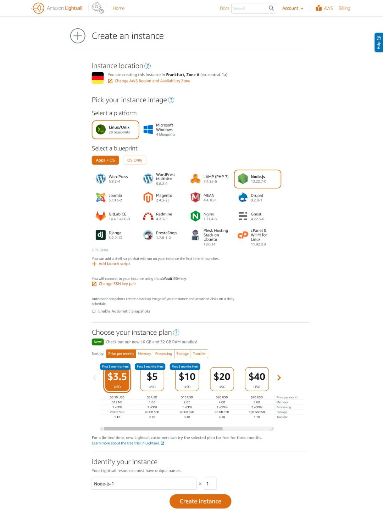

# Amazon Web Services (AWS)

Amazon Web Services (AWS) is a subsidiary of Amazon providing on-demand cloud computing platforms and APIs to individuals, companies, and governments, on a metered pay-as-you-go basis. These cloud computing web services provide a variety of basic abstract technical infrastructure and distributed computing building blocks and tools. One of these services is Amazon Elastic Compute Cloud (EC2), which allows users to have at their disposal a virtual cluster of computers, available all the time, through the Internet. AWS's virtual computers emulate most of the attributes of a real computer, including hardware central processing units (CPUs) and graphics processing units (GPUs) for processing; RAM; hard-disk/SSD storage; a choice of operating systems; networking; and pre-loaded application software such as web servers and databases.

AWS offers a plethora of [products](https://aws.amazon.com/products/?nc2=h_ql_prod) in their infrastructure, for all the different team sizes, solo to enterprise and for all use cases, you can imagine. From web applications, databases, networks, and storage, to IoT, machine learning, games development, and quantum computing. In this lesson, we are going to explore Amazon EC2, Amazon Lightsail, Amazon S3, and Amazon Elastic Beanstalk.

## Amazon EC2

Elastic compute cloud is the main building block for most of Amazon Services. It is the cloud that is responsible for provisioning and offering you the computing instances you need. Most services will, under-the-hood, simply run EC2 machines to support your use case. For example, running a relational database would create an EC2 instance that would host that database. 

EC2 can be used to run, build, and execute your application code. These machines are predefined with a range of specifications that make them appealing to all use cases. The EC2 fleet has machines for the below purposes:

### General Purposes

These machines come with a balanced set of virtual CPUs, memory, storage, and network bandwidth. They can be used for general purposes, like hosting web applications, databases, building and compiling codebase, etc. The general purpose computing fleet contains different computing families that come with either Intel, AMD, or ARM processors. Each family has a range of sizes that corresponds to a number of vCPUs and memory allocations.

General purposes fleet also have the economical burstable CPU machine `T` family: T4g, T3, T3a, and T2. These are machines that offer better performance price that provides a baseline level of CPU performance with the ability to burst CPU usage at any time for as long as required.

The general-purpose machines are, most of the time, your target to host web applications that can be scaled. You can either pick a burstable machine in the T3 family or use the balanced M5 family that is well suited for most web workloads.

### Compute Optimized

Compute Optimized instances are ideal for compute-bound applications that benefit from high-performance processors. Instances belonging to this family are well suited for batch processing workloads, media transcoding, high-performance web servers, high-performance computing (HPC), scientific modeling, dedicated gaming servers, and ad server engines, machine learning inference, and other compute-intensive applications.

Here is a comparison between a compute-optimized machine, and its general purposes counterpart:

| Type      | vCPU | Memory (GiB) | On-demand hourly rate (Ohio) | CPU Type                                 |
| --------- | ---- | ------------ | ---------------------------- | ---------------------------------------- |
| C5.xlarge | 4    | 8            | $0.170                       | Intel Xeon (Cascade Lake) 3.6GHz turbo   |
| M5.xlarge | 4    | 16           | $0.192                       | Up to 3.1 GHz Intel Xeon® Platinum 8175M |

### Memory Optimized

Memory-optimized instances are designed to deliver fast performance for workloads that process large data sets in memory. They can be used for image processing, high-performance databases, distributed web scale in-memory caches, mid-size in-memory database, real-time big data analytics, and other enterprise applications. 

Here is a comparison between a memory-optimized machine R5, and its general purposes counterpart, the M5:

| Type      | vCPU | Memory (GiB) | On-demand hourly rate (Ohio) | CPU Type                                 |
| --------- | ---- | ------------ | ---------------------------- | ---------------------------------------- |
| R5.xlarge | 4    | 32           | $0.252                       | Up to 3.1 GHz Intel Xeon® Platinum 8000  |
| M5.xlarge | 4    | 16           | $0.192                       | Up to 3.1 GHz Intel Xeon® Platinum 8175M |

### Accelerated Machines

Accelerated computing instances use hardware accelerators, or co-processors, to perform functions, such as floating-point number calculations, graphics processing, or data pattern matching, more efficiently than is possible in software running on CPUs. These are expensive machines that come with GPUs or accelerators that can be used for hashing, ML apps, genomic research, financial analysis, etc...

These computers can be equipped with NVIDIA A100 (P4 family), V100 (P3 Family), or K80 (P2 family). There are other choices as well like AWS Trainium accelerators, AWS Inferentia Chip, FPGAs, and the like.

## Running EC2

You can launch EC2 through the EC2 Console. When you create a machine, you will have to assign it the Amazon Machine Image (AMI) that is needed for your workload. You have to also attach an EBS volume to it if it doesn't come with an internal storage device in a form of NVMe storage based on the type.

During instance creation, you will have to attach a security group to the machine. The security group will define your firewall settings. For example, opening port 443 for HTTPs server. You will also either generate a private key that you can use to SSH into the machine or use a pre-generated key.

Once the machine is provisioned, it will have a public IP address that you can use to connect to the machine. This IP address is dynamic and will change each time the machine restarts. You might need to attach a static IP address to that machine so it doesn't change, and can be attached to different instances. Your DNS manager can point your domain to that static IP address.

Additionally, upon creation, you can also launch many instances with the same configurations at once. Or they can also be added to a scaling group that can launch more instances for you when needed or replaces unhealthy instances. Then you can create a load balancer that targets all your machines and balances the workload.

### EC2 Costs

When you use AWS to run instances, you pay for the different services you use. The simplest machine will require an Elastic Block Storage (EBS) volume to store data, and network bandwidth to transfer data. So your cost breakdowns will be for:

- The hours the instance is running are billed by seconds for Amazon Linux, Windows, and Ubuntu AMIs.
- The storage usage is billed by seconds as well in GB-month unit pricing.
- The data transfer bandwidth
  
## Amazon Lightsail

The EC2 console can be intimidating, and not very user-friendly. Lots of configurations and technical jargon. Amazon is now offering Lighsail, a service with a straightforward user interface to launch EC2 instances marketed as VPS for as low as $3.5 per month. 

In Lightsail, you define the OS and the applications needed, as well as the size of the machine, then simply run it. You can SSH to the machine in the Lightsail web-based SSH console. You can run databases, create load balancers and static IPs directly from the Lightsail console.

When you are ready to scale your applications or move away from Lightsail, you can easily migrate to EC2 and start managing your servers from the EC2 console.

## Amazon Simple Storage Service (S3)

Amazon S3 is a cloud storage service that you can use to store and retrieve any amount of data from anywhere. It offers industry-leading scalability, data availability, security, and performance. Customers of all sizes and industries can store and protect any amount of data for virtually any use case, such as data lakes, cloud-native applications, and mobile apps. With cost-effective storage classes and easy-to-use management features, you can optimize costs, organize data, and configure fine-tuned access controls to meet specific business, organizational, and compliance requirements.

You can get started with S3 by creating a bucket in a specific AWS region. Then you need to define access control for this bucket by either making it public or private. You can also configure it to be versioned, which means data overwrite will retain previous versions as well.

Data can be migrated to the bucket from 3rd party cloud storage, locally from your machine, or from another bucket. To upload local files, you can use the AWS CLI to upload and sync the data right away. Or you can upload directly through the web interface.

AWS s3 also has an API that you can use to upload and manage data. Each object in s3 will have a direct link assigned to it so you can read it in your web app, or mobile app.

S3 is billed by storage location, storage amount, access requests, data transfer, and management tools usage if used. 

## Amazon Elastic Beanstalk

This is Amazon's PaaS offering which is a platform to host your applications without having to configure instances, networks, and storage. You can use it to host Node.JS, PHP, RUBY, Python, and other applications. Elastic beanstalk will handle providing the platform to run your app, and scale it as needed.

Running an app in elastic beanstalk is as simple as defining which platform you need, and uploading your source code. You can also configure some scaling templates to help beanstalk scale your apps effectively and within budget.

With Elastic beanstalk, you only pay for the resources used by your app. The EC2 machines, the S3 storage, and network bandwidth.

## Conclusion

When it comes to the cloud, it can be a daunting task to know what to use and how to use it. Our advice is to jump in and try it out. You can start with AWS and then move to other providers when you gain more insight into how you manage your cloud infrastructure. AWS can be a good choice simply because it is very well covered by the community. You can get most of your questions answered with quick research.

Amazon has a lot more to offer. However, this lesson was intended to get you to know the basic offerings that you can use to run your applications. You will also get to know more services like AWS Lambda cloud function in the serverless architecture lesson, which is yet another service to run applications in the cloud.