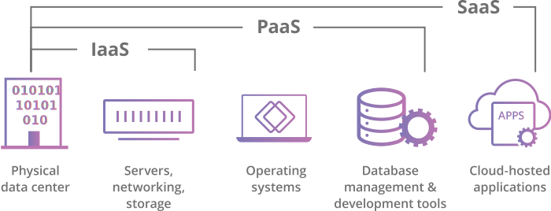

# Iaas, PaaS, and SaaS

You may have read these terms in your journey to learn technologies of the web. They refer to cloud computing services offered to end-users in different formats. In this lesson, we will learn about what each of them is, and what are the differences between them. We will also cover how to choose one over the other in deploying your web application.

## Software as a Service

This is the most common offering in cloud services. It is to offer you a service that is connected to the cloud in the form of software. It is also known as cloud application services. Mostly, SaaS applications run directly through the web browser, which means we do not require to download and install these applications. They are mostly offered for a monthly or annual subscription model. Some examples of such services are:

- Google Apps (Workspaces: Docs, Spreadsheets, Drive)
- Salesforce
- Dropbox
- Slack
- Shopify

You might be better off relying on such services instead of creating and hosting your own. For example, if your organization is requiring a sort of data storage service, you can rely on Dropbox or Google Workspaces to serve your users. Most of these services offer APIs and libraries to integrate into your app and customize the use case.

## Platform as a Service

Cloud platform services, also known as Platform as a Service (PaaS), provide cloud components to certain software while being used mainly for applications. PaaS delivers a framework for developers that they can build upon and use to create customized applications. All servers, storage, and networking can be managed by the enterprise or a third-party provider while the developers can maintain management of the applications.

In PaaS, you won't need to manage instances, storage, networks, and the likes. The platform is built to run your application and offer you all the cloud components that you need. We can take Heroku as an example of PaaS.

With Heroku, using their platform or CLI you can start by creating an app, and defining where do you want your app to be located (region). Then you simply deploy your code on this app. Heroku will take care of provisioning the resources needed to run your app, the programming language runtime libraries, storage, and availability. It will scale your app based on need, and offer you a domain to access your application. It would also provide all the metrics and tools to help you ensure seamless operation of your software in the cloud as well as continuous integration and deployment. Any change you do in the source code, Heroku would pull the changes, and build your app replacing the current version without downtime.

Other examples of PaaS are AWS Elastic Beanstalk, Google App Engine, OpenShift, Vercel.

## Infrastructure as a Service

_Image credits: [CloudFlare](https://www.cloudflare.com/learning/serverless/glossary/platform-as-a-service-paas/)_

IaaS offering is made of highly scalable and automated compute resources. IaaS is fully self-service for accessing and monitoring computers, networking, storage, and other services. IaaS allows businesses to purchase resources on-demand and as-needed instead of having to buy the hardware outright.

IaaS delivers cloud computing infrastructure, including servers, networks, operating systems, and storage, through virtualization technology. These cloud servers are typically provided to the organization through a dashboard or an API, giving IaaS clients complete control over the entire infrastructure. IaaS provides the same technologies and capabilities as a traditional on-premises datacenter without having to physically maintain or manage all of it. IaaS clients can still access their servers and storage directly, but it is all outsourced through a “virtual datacenter” in the cloud.

As opposed to SaaS or PaaS, using this offering will delegate the responsibility for managing aspects such as applications, runtime, operation systems, middleware, and data to you. However, providers of the IaaS manage the servers, hard drives, networking, virtualization, and storage. Some providers even offer more services beyond the virtualization layer, such as databases or message queues.

Let's take AWS as an example of an IaaS vendor. AWS offers a variety of computing machines with versatile processing power, memory, storage, and even GPU units. You may select your machine requirements, storage, specs, and they provision it for you. It's the vendor's responsibility to also ensure isolation of machines, physical security of resources, and seamless operation of the infrastructure.

Having access to a computing machine, the rest is left to you to prepare the resource to run your app.

Other examples of IaaS vendors: DigitalOcean, Linode, Google Compute Engine, Microsoft Azure.

## Conclusion

When time comes to deploy your app, you might get overwhelmed with all these different offerings out there, and there are still more like DB as a service, Functions as a service, AI as a service, etc... This lesson was intended to give you a quick overview of each of these top-level services.

If you've written your code, SaaS might not be the way forward. However, before jumping into paying for infrastructure, PaaS might be a good test for your application. It usually comes with suitable and competitive pricing compared to IaaS where you only pay for the resources you use. Other times, when high customizability is needed you could be better off renting machines and customizing your own infrastructure.

The next lesson will cover some examples and a guide on how to choose a service.
