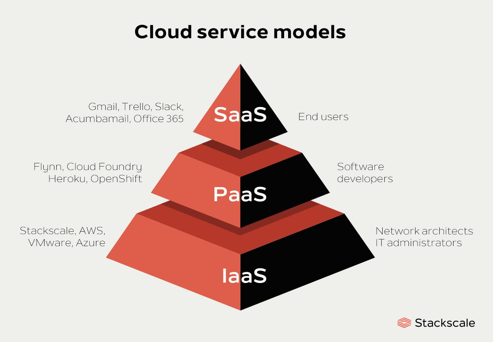

# Selecting a cloud service offering

In the last lesson, we discovered the differences between cloud services, mainly what are SaaS, PaaS, and IaaS.

In this lesson, we will try to shed a light on how to choose the right offer to run and deploy your application.

## When to pick SaaS?

SaaS may be the most beneficial option in several situations, including:

- Startups or small companies that need to launch e-commerce quickly and don’t have time for server issues or software.
- Short-term projects that require quick, easy, and affordable collaboration.
- Applications that aren’t needed too often, such as tax software.
- Applications that need both web and mobile access.

SaaS usually is used with the assumption that it is intended for the end-user directly. This means there is no source code or application needed to use the service.

However, in some cases, when you already have a backend and you would like to test a new feature or integrate with other tools in your company's domain, it might be faster to prototype by integrating with a SaaS instead of modifying your own backend. A prominent example is the usage of documentation hosting services to host your app's documentation.

Or sometimes, you can build a frontend-only that integrates with some SaaS through their APIs. Like building a scheduling system that needs access to users' calendars. Your frontend app can directly integrate with Google Calendar or iCloud Calendar to schedule appointments.

### SaaS advantages

SaaS provides numerous advantages to employees and companies by greatly reducing the time and money spent on tedious tasks such as installing, managing, and upgrading software. This frees up plenty of time for technical staff to spend on more pressing matters and issues within the organization.

### SaaS Limitations & Concerns

- **Lack of integration support**. Many organizations require deep integrations with on-premise apps, data, and services. The SaaS vendor may offer limited support in this regard, forcing organizations to invest internal resources in designing and managing integrations. The complexity of integrations can further limit how the SaaS app or other dependent services can be used.
- **Data security**. Large volumes of data may have to be exchanged to the backend data centers of SaaS apps in order to perform the necessary software functionality. Transferring sensitive business information to a public-cloud-based SaaS service may result in compromised security and compliance in addition to a significant cost for migrating large data workloads.
- **Customization**. SaaS apps offer minimal customization capabilities. Since a one-size-fits-all solution does not exist, users may be limited to specific functionality, performance, and integrations as offered by the vendor. In contrast, on-premise solutions that come with several software development kits (SDKs) offer a high degree of customization options.
- **Performance and downtime**. Because the vendor controls and manages the SaaS service, your customers now depend on vendors to maintain the service’s security and performance. Planned and unplanned maintenance, cyber-attacks, or network issues may impact the performance of the SaaS app despite adequate service level agreement (SLA) protections in place.

## When to pick PaaS?

PaaS is very attractive to both small and large teams alike that don't have in-house system admins. It is the go-to choice in the MVP phase to seamlessly deploy and start running your application without the need to configure multiple services and apps.

PaaS removes the overhead of facilitating inter-app communications. It comes out of the box with the predefined configuration that makes it easy to plug and play your app source code into deployment.

It also offers plugins that you can include into your backend to enable certain services, like integrating Redis, message brokers, or load balancers.

Utilizing PaaS is beneficial, sometimes even necessary, in several situations. For example, PaaS can streamline workflows when multiple developers are working on the same development project. If other vendors must be included, PaaS can provide great speed and flexibility to the entire process. PaaS is particularly beneficial if you need to create customized applications.

This cloud service also can greatly reduce costs and it can simplify some challenges that come up if you are rapidly developing or deploying an app.

No matter the size of your company, using PaaS offers numerous advantages, including:

- Simple, cost-effective development and deployment of apps
- Scalable
- Highly available
- Developers can customize apps without the headache of maintaining the software
- Significant reduction in the amount of coding needed
- Automation of business policy
- Easy migration to the hybrid model

## When to pick IaaS?

When you want to have granular control over your budget or complicated apps that you need to hand-tailor availability, scaling, communication, or when you require 100% privacy and control over your code and data and you have the team who can leverage the power of the infrastructure while not minding the extra training needed, your pick should go with IaaS.

Just like with SaaS and PaaS, IaaS is mostly advantageous and appeals to:

- Startups and small companies may prefer IaaS to avoid spending time and money on purchasing and creating hardware and software.
- Larger companies may prefer to retain complete control over their applications and infrastructure, but they want to purchase only what they actually consume or need.
- Companies experiencing rapid growth like the scalability of IaaS, and can change out specific hardware and software easily as their needs evolve.

Anytime you are unsure of a new application’s demands, IaaS offers plenty of flexibility and scalability.

## Conclusion

As you've seen, the cloud offers are countless, and it is really the preference of you and your team to pick how should you host and deploy your applications. Platform as a service is always a good and affordable solution to MVP test, run, and scale your application. It is usually the one that comes with a free tier that can help you deploy and test your application during development without paying for anything.

If the platform was not enough, shifting to IaaS could be a great solution to run your app.

Using containerized applications has made to process of deploying and shifting between providers lots of steps easier as we will discover that in the upcoming lessons.
