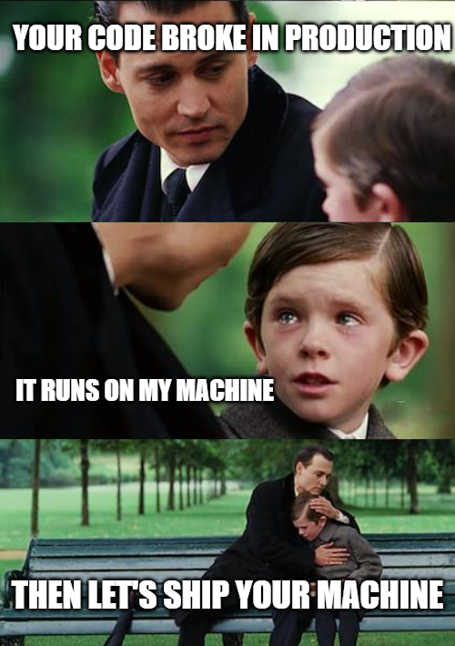
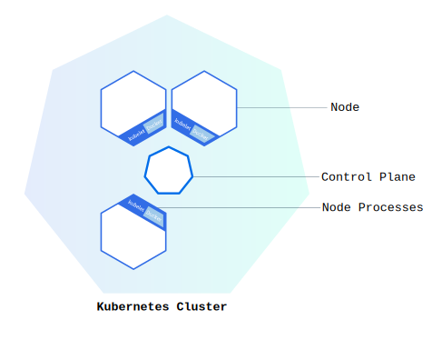
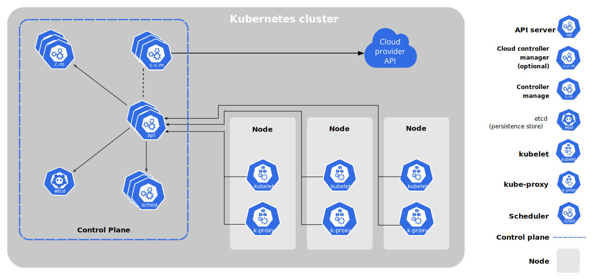

# Docker and Kubernetes

In this course, you've been using containers in some of the previous assignment. They are made possible through the use of docker.

Containers are a form of operating system virtualization. They consists of an entire runtime environment: an application, plus all its dependencies, libraries and other binaries, and configuration files needed to run it, bundled into one package.

In this lesson, we will explore why we might need to use container, and how to use them effectively.

## Machine Virtualization vs Containers

Containers and virtual machines are both ways of deploying applications inside environments that are isolated from the underlying hardware. The chief difference is the level of isolation.

With virtualization, the package that can be passed around is a virtual machine, and it includes an entire operating system as well as the application. A physical server running three virtual machines would have a hypervisor (aka virtual machine monitor) and three separate operating systems running on top of it.


By contrast a server running three containerized applications, runs a single operating system, and each container shares the operating system kernel with the other containers through what is called a container engine. One of the most famous Engines is Docker.

## Why use containers?



_And that's how docker was born_

The problem presented in this famous meme originated from code that would work on developers local environment, but then breaks when deployed in production. This happens for so many reasons such as misconfigurations, versions' mismatches, availability of run time tool, etc. They turned to find solution in implementing Virtualization and Containerization.

Inside a container are all the necessary executables, binary code, libraries, and configuration files. Containers have to be based of an image that contains the necessary binaries and run-time library that an app needs to run. They are shipped completely as another image built on top of each others in a structure called layers.

Containers are a streamlined way to build, test, deploy, and redeploy applications on multiple environments from a developer’s local laptop to an on-premises datacenter and even the cloud. Benefits of containers include:

- **Less overhead**: Containers require less system resources than traditional or hardware virtual machine environments because they don’t include operating system images.
- **Increased portability**: Applications running in containers can be deployed easily to multiple different operating systems and hardware platforms.
- **More consistent operation**: DevOps teams know applications in containers will run the same, regardless of where they are deployed.
- **Greater efficiency**: Containers allow applications to be more rapidly deployed, patched, or scaled.
- **Better application development**: Containers support agile and DevOps efforts to accelerate development, test, and production cycles.

## Usage of Docker

Docker is one of the most famous containers engine. It is available on all operating systems and offers containerization abilities seamlessly on Mac, Windows, and Linux.

You can use docker to provision, build, and run your containers. It will manage containers communication with the Host OS and other containers.

You are advised to [install Docker](https://docs.docker.com/get-docker/) if it isn't already installed on your machine to follow through with this lesson. Alternatively, head to [Play with Docker](https://labs.play-with-docker.com/) website to experiment with docker playground.

### Images

A Docker image is a read-only template that contains a set of instructions for creating a container that can run on the Docker platform. It provides a convenient way to package up applications and preconfigured server environments, which you can use for your own private use or share publicly with other Docker users. Docker images are also the starting point for anyone using Docker for the first time.

Docker images are built using a `Dockerfile`. Each dockerfile should start with a `FROM` directive to instruct what is the parent/base image for this new image, hence creating layers that go all the way to the `scratch` image.

Images are hosted in registries that serve as a catalogs of storage locations, known also as repositories, where you can `push` and `pull` container images. You might already be familiar with [Docker Hub](https://hub.docker.com/) the official image resource where you can access more than 100,000 container images shared by software vendors, open-source projects, and Docker’s community of users. You can also use the service to host and manage your own private images.

Images can be tagged to offer different flavors, configurations, and versions. If an image is created without a tag, it will be assigned the tag `latest` automatically.

> ⚠️ Warning: the tag `latest` doesn't mean it is the newest version. It simply refers to the last-pushed _untagged_ image. Always use specific tags with images to avoid discrepancies in future builds when a tag points to a newer image.

### Docker Pull

This is a docker command that you can use to pull images from a registry. Pulling an image means that its template will be downloaded with all the intermediate layers that are needed to run it.

Pull can be automated as well when you build the dockerfile. The `FROM` directive effectively means to pull the parent image needed for this build. Pulled images will stay on your local machines until you prune or delete them.

Let's pull our first image. In your terminal, run the command:

```bash
docker pull node:16.13-alpine3.14
```

This is Node.js image that corresponds to Node version 16.13.x running inside a Linux alpine distro version 3.14. If you base your backend app on this, currently LTS, version of node, you will make sure that node will always be compatible with your source code. The only future update that can happen to this image is minor version updates that are patches and bug fixes.

> 💡TIP: The `alpine` linux distro is a very light weight version of linux based on busybox. If your backend app doesn't need super linux features, most of the time this will be enough.

### Docker Run

Use docker run command when you want to start a new docker container from an image. It will pull the image if not existing and then create and start the container with that image. For example if we want to start the node image we pulled in interactive mode we can run:

```bash
docker run -i -t node:16.13-alpine3.14 /bin/sh
```

This command will start that container, and override the default entrypoint to run the shell. Notice the options `-i -t` which are required for the interactive mode, i.e. to be able to run commands in shell.

The run command has lots of options that can be passed. For example to expose and map a port in the container to a host port, you can specify the option `-p` with the port mapping, e.g. `-p 3000:80`. This will expose the port 80 in the container and map it to port 3000 on the host.

Another option is to mount files from host to container using the `-v` option.

In this example, we will mount a local directory that contains index.html file, and run a server using nginx that serves that file.

First run this command in your terminal:

```bash
mkdir html && echo "<html><body>Hello from NGINX</body></html>" > html/index.html
```

This will create a directory named `html` in your current directory, and create a simple index.html file inside of it.

Then let's run an nginx container and mount this file to its server root. Nginx also by default listens on port 80. We will map it to port 5000.

```bash
docker run -d -p 5000:80 --rm -v `pwd`/html:/usr/share/nginx/html nginx:alpine
```

This will run the container in detached mode `-d` which means it runs in the background. Exposes the port 80 used by default in Nginx and map to port 5000 in the host.

The `--rm` modifier instructs docker to delete the container once it is stopped. Every time we use the run command, a new container will be created. We don't want that so we remove it at the end.

The `-v` modifier is to mount a local host volume to the container. The mounting points need to be a absolute path not a relative path. Thus we are using the `pwd` command to expand the current working directory path, then appending the created `html` directory. That will be mapped to `/usr/share/nginx/html` in the container which is the root server directory in nginx by default.

Now if you are using your local machine, you can head to `http://localhost:5000`. It will respond with `Hello from NGINX` page, the one we created earlier.

You can run the command `docker ps` to see all **running** containers in your machine currently. It will output a table like this:

| CONTAINER ID | IMAGE        | COMMAND                | CREATED        | STATUS        | PORTS                | NAMES          |
| ------------ | ------------ | ---------------------- | -------------- | ------------- | -------------------- | -------------- |
| c897f993bf40 | nginx:alpine | "/docker-entrypoint.…" | 16 minutes ago | Up 16 minutes | 0.0.0.0:5000->80/tcp | boring_wescoff |

You can interact with any container using either the container ID or the container name. For example if you want to attach your terminal to the detached Nginx container you can run:

```bash
docker attach boring_wescoff
```

For this container you might not see any output but if you refresh the page at `http://localhost:5000` you will see your GET request getting logged.

Similarly, you can kill the running container with the command:

```bash
docker kill boring_wescoff

# OR

docker kill c897f993bf40
```

That will kill the detached running container, and remove it as specified by the `--rm` option.

> 💡Tip: Remember to substitute the container name with your version from the output of `docker ps`. This is a randomly generated value if not specified using the `--name` option.

### Docker Build

The docker build command is used to build an image from a `Dockerfile`. As a backend developer, most of the time you won't be running images directly from Docker Hub. Instead, you will use these images as a base for your needed functionality. You can build images by first creating a Dockerfile with instruction on how your image should be built. The format of a Dockerfile is:

```dockerfile
# Comment
INSTRUCTION arguments
```

Let's see an example Dockerfile:

```dockerfile
# Our app will always target node lts
FROM node:lts-alpine
RUN apk add --no-cache python3 g++ make
WORKDIR /app
COPY . .
RUN yarn install --production
EXPOSE 5000
CMD ["node", "src/index.js"]
```

Each dockerfile should start with `FROM` directive. It is to indicate what is the base image that will be used for building this one. And here, we are using the image `node` with the tag `lts-alpine` that will always pull the current long-term support node version with alpine distro.

The `RUN` directive is used to run a shell command inside the container. Here, we are installing `python3`, `g++`, and `make` binaries that wouldn't, otherwise, be available in a node image. Our app might need extended functionality through the use of python.

The `WORKDIR` directive is to instruct docker to change directory to the `/app` directory. Thus further commands will run there.

`COPY` is the command to copy files from host to container. Here we are instructing to copy `.`, i.e. everything in current directory (relative to the Dockerfile) to `.` in the container which expands to `/app` as specified in `WORKDIR`. This is usually the command used to move your source code to the container.

We use `RUN` again to run a the `yarn install` command which will install all the dependencies for our node application. Then we `EXPOSE` the port 5000 that our app will listen to.

Finally we end it with `CMD` which is called the container entrypoint command. It is the command that will run when we run the container for this image. Here it is to start `node` with the argument `src/index.js`, effectively executing that file.

> 💡 Tip: The instruction is not case-sensitive. However, convention is for them to be UPPERCASE to distinguish them from arguments more easily.

To build this docker image we can use the build command in the directory where your Dockerfile is located as follows:

```bash
docker build -t recoded/app-server:latest -t recoded/app-server:v1.0 .
```

This will build the Dockerfile inside the current directory `.`, giving it the name `recoded/app-server` with 2 tags, `latest` and `v1.0`.

You can download this [zip file](../assets/example.zip) to experiment with working with Dockerfile. It contains a simple express server that responds with Hello world.

> 💡 Tip: To list the images in your environnement you can use `docker images` or `docker image ls`

> 💡 Tip: The name can really be anything. It is a convention to use `org/name` in order to distinguish your images. If you are planning to publish them to a registry, make sure `org` refers to your registry ID. For example if you are pushing to Docker Hub, you need to [create a Docker ID](https://hub.docker.com/signup) first, then use `docker login` command to sign in to the hub. Finally, to push the image you can run `docker push YOUR_DOCKER_ID/app-server:latest`.

> 💡 Tip: To change an image name, use the command `docker image tag CURRENT_TAG NEW_TAG`. For example if your Docker ID was `jack`, you can create a new tag using `docker image tag recoded/app-server:latest jack/app-server:latest`. Then you can push it to Docker Hub. Otherwise, if your ID wasn't `recoded` then Docker Hub will refuse to push.

Once your image is built, you can run a container based of it the same way:

```bash
docker run -d -p 5000:5000 --rm recoded/app-server:v1.0
```

## Docker Compose

So far, we've been directly working with Docker command line to build a single image. That is helpful to experiment and play with docker. However, it isn't convenient when working with multiple images and a large project. Many options to track that can render it useless in a development environment. It is the time to explore `docker-compose`.

Docker compose is an orchestration tool. This probably brought the image of an orchestra to your mind. It's not that far-off though!


Docker compose, indeed, takes the role of a conductor. You define a configuration file that defines how your images interact with each other, and docker compose orchestrates that interaction.

In most backend dev environment, many technologies are in the game. You would have a database to persist data, memory cache or a message broker like Redis or RabitMQ. A job queue perhaps that can process jobs asynchronously. And a code base that might contain a react application as a client, a flutter application as a mobile app client, and a node application as a server.

To make sure all of these services work in harmony, you need to have a versioned configuration file that:

- Defines these services,
- Define how should they be built
- Define which ports these services use
- Define environment variables that provide customized operation
- Define what happens when these app crash
- Define dependency of these apps, which should start first and how do they connect
- Define how the files are persisted inside these container

All of this can be done using a `docker-compose.yml` file. It is a YAML based file that defines these configurations.

An example `docker-compose.yml` file look likes this:

```yml
version: "3.9"

services:
  mysqldb:
    image: mysql:5.7
    restart: always
    volumes:
      - db_data:/var/lib/mysql
    environment:
      MYSQL_ROOT_PASSWORD: AStrongPasswordThatShouldntBeAddedToGit
      MYSQL_DATABASE: mydb
      MYSQL_USER: admin
      MYSQL_PASSWORD: AnotherStrongPasswordThatShouldntBeAddedToGit

  server:
    depends_on:
      - mysqldb
    container_name: node-app
    restart: always
    build:
      context: .
    volumes:
      - ./:/backend-app
    ports:
      - "5000:5000"
    environment:
      DB_HOST: mysqldb
      DB_USER: admin
      DB_PASSWORD: AnotherStrongPasswordThatShouldntBeAddedToGit
      DB_NAME: mydb
      SERVER_PORT: "5000"
volumes:
  db_data: {}
```

### File Specs

A docker compose file in version 3 contains 6 objects at the top level: `version`, `services`, `networks`, `volumes`, `configs`, and `secrets` of which only `services` is _required_.

At the top of the file, we first defined the version of the compose syntax we are using, here `3.9`

> 💡 Tip: YAML files are similiar to JSON files, they use indentation instead of {} to define the scope. Check out this [YAML to JSON converter](https://jsonformatter.org/yaml-to-json) to see this in action.

Inside `services`, we define the containers that are going to be run. Each service should have a name followed by service configurations. A service should define either an `image` or a `build` context directive. `image` will pull the image from the registry, while `build` will build a dockerfile.

### Service 1

The `mysqldb` service in the example, uses the image `mysql:5.7`. We define a restart policy which would define what should happen when the app crashes. `always` will always restart the container.

In `volumes` we define mapping. It is similar to `-v` option in `docker run`. For the `mysqldb` service, we are defining a named volume to be persisted even if the container was deleted. That is because we don't want to lose the database data. We map `/var/lib/mysql` in the container to a named volume `db_data` that is defined at the bottom of the file. This named volume will be managed by docker and persisted in the host machine.

The `environment` directive is to define all the needed environment variables inside the container. In this case, these are used by the `mysql` image to define initial settings and credentials.

> ⚠️ Warning: Docker compose files are usually checked out to git and are versioned. That is why you should never keep your database credentials in the docker compose file directly. Instead you can use a `.env` file that is ignored by git to define these variables and reference them directly in docker-compose.yml. You can also use service specific .env files and pass them to the container using the `env_file` directive.

### Service 2

The second service we named `server` here `depends_on` the `mysqldb` service. That effectively means that `server` won't be started unless `mysqldb` is up and running. The service container will have the name `node-app`.

In this service we won't be using an image, instead we will be building a Dockerfile that is in the current directory. This is defined using the build `context` directive which instructs docker on the location of the Dockerfile.

Volume mapping in this service will be done through host mounting. That means we are mounting the current directory `./` to `/backend-app` inside the container. Host mounting will make these files available inside the container through sharing. These files will be live inside the container, which means if you changes them in the host, they will be updated in the container. Very useful for debugging and development.

We can expose and map ports inside the service by using the `ports` directive, it takes an array of items in case we wanted to expose more than one port.

One thing to notice in the `environment` variables for this service is the item `DB_HOST`. It takes the value `mysqldb` which is the service name for the mysql database. That is because the name of the service will also be the _HOST NAME_ of the container inside docker network. Thus the node app can connect to mysql internally through the docker network without having to expose it to the localhost:

```js
const mysql = require("mysql");
const connection = mysql.createConnection({
  host: process.env.DB_HOST, // mysqldb
  database: process.env.DB_NAME, // mydb
  user: process.env.DB_USER, // admin
  password: process.env.DB_PASSWORD, // AnotherStrongPasswordThatShouldntBeAddedToGit
});
```

If you wanted to connect to the `server` service from another service, you would use `http://server/END_POINT`.

> 💡Tip: Always remember to define all your named volumes at the end. If you server contains an upload function, the files won't be persisted unless you map them to a named volume or a host mount.

### Running and stopping the services

Now that your `docker-compose.yml` file is defined, you can start all the containers using the command:

```bash
docker-compose up
```

Which will start all the containers making sure the to start the dependent services first. This command will try to `docker run` the relevant images to these services. If not found, it will either pull or build them then run the containers. You can run the containers in detached mode using the option `-d`.

To stop the containers, you can run `docker-compose stop` to only stop the containers. Or `docker-compose down` to stop and remove containers, networks, images, and volumes.

You can pass the option `--build` if you wanted to rebuild all the images again using an updated docker-compose file.

Compose has commands for managing the whole lifecycle of your application:

- Start, stop, and rebuild services
- View the status of running services
- Stream the log output of running services
- Run a one-off command on a service

You can define different configurations using different docker-compose files. For example you can define `docker-compose.prod.yml` and `docker-compose.test.yml`. You can specify which file to use using the `-f` options:

```bash
docker-compose -f ./docker-compose.prod.yml up
```

### Documentation

Docker and Docker Compose have great [documentation](https://docs.docker.com/compose/reference/) online with lots of examples and resources. The capabilities of docker can never really be covered in a single lesson. It is highly recommended that you checkout the documentation to harness the full power of these tools.

## Kubernetes (K8s)

Containers are a good way to bundle and run your applications. In a production environment, you need to manage the containers that run the applications and ensure that there is no downtime. For example, if a container goes down, another container needs to start. Wouldn't it be easier if this behavior was handled by a system?

That's how Kubernetes comes to the rescue! Kubernetes is also an orchestration framework to run distributed systems resiliently across multiple servers. It takes care of scaling and failover for your application, provides deployment patterns, and more with ability to manage tens or even hundreds of containers, with containers talking to each other and interacting in some way.

Kubernetes provides you with:

- **Service discovery and load balancing** Kubernetes can expose a container using the DNS name or using their own IP address. If traffic to a container is high, Kubernetes is able to load balance and distribute the network traffic so that the deployment is stable.
- **Storage orchestration** Kubernetes allows you to automatically mount a storage system of your choice, such as local storages, public cloud providers, and more.
- **Automated rollouts and rollbacks** You can describe the desired state for your deployed containers using Kubernetes, and it can change the actual state to the desired state at a controlled rate. For example, you can automate Kubernetes to create new containers for your deployment, remove existing containers and adopt all their resources to the new container.
- **Automatic bin packing** You provide Kubernetes with a cluster of nodes that it can use to run containerized tasks. You tell Kubernetes how much CPU and memory (RAM) each container needs. Kubernetes can fit containers onto your nodes to make the best use of your resources.
- **Self-healing** Kubernetes restarts containers that fail, replaces containers, kills containers that don't respond to your user-defined health check, and doesn't advertise them to clients until they are ready to serve.
- **Secret and configuration management** Kubernetes lets you store and manage sensitive information, such as passwords, OAuth tokens, and SSH keys. You can deploy and update secrets and application configuration without rebuilding your container images, and without exposing secrets in your stack configuration.

### K8s Cluster

You can use Kubernetes to deploy your apps by running a cluster. A Kubernetes cluster is a set of nodes that run containerized applications. It allow containers to run across multiple machines and environments: virtual, physical, cloud-based, and on-premises.

Kubernetes clusters are comprised of one master node and a number of worker nodes. These nodes can either be physical computers or virtual machines, depending on the cluster.



Clusters can be deployed on your local machine, into the cloud, or your own datacenter. If you don't want to manage a Kubernetes cluster yourself, you could pick a managed service like [Amazon Elastic Kubernetes Service (EKS)](https://aws.amazon.com/eks/) or [Google Kubernetes Engine (GKE)](https://cloud.google.com/kubernetes-engine).

For development purposes, you can use [minikube](https://minikube.sigs.k8s.io/docs/start/), an open source tool that enables you to run Kubernetes on your laptop or other local machine. It can work with Linux, Mac, and Windows operating systems. It runs a **single-node cluster** inside a virtual machine on your local machine.

### Nodes

Kubernetes runs your workload by placing containers into Pods to run on _Nodes_. A node may be a virtual or physical machine, depending on the cluster. Each node is managed by the control plane and contains the services necessary to run Pods (which are Kubernetes units of containers).

> 💡 Tip: Control Plane is the container orchestration layer that exposes the Kubernetes API and interfaces to define, deploy, and manage the lifecycle of containers.

Typically you have several nodes in a cluster; in a learning or resource-limited environment, you might have only one node.



### Pods

Pods are the smallest deployable units of computing that you can create and manage in Kubernetes. It is effectively, a unit of work.

A Pod (as in a pod of whales or pea pod) is a group of one or more containers, with shared storage and network resources, and a specification for how to run the containers. A Pod's contents are always co-located and co-scheduled, and run in a shared context. A Pod models an application-specific "logical host": it contains one or more application containers which are relatively tightly coupled.

In non-cloud contexts, applications executed on the same physical or virtual machine are analogous to cloud applications executed on the same logical host.

> 💡 Tip: You can think of a pod as your local computer. You can run http server like apache and a database like mysql both accessible through `localhost`. This is what `logical host` means.

Each Pod is meant to run a single instance of a given application. If you want to scale your application horizontally (to provide more overall resources by running more instances), you should use multiple Pods, one for each instance. In Kubernetes, this is typically referred to as _replication_. Replicated Pods are usually created and managed as a group by a workload resource and its controller.

Pods can be defined similar to how you define a docker-compose file. It defines the containers and their images, ports, and other data.

```yml
# simple-pod.yml
apiVersion: v1
kind: Pod
metadata:
  name: nginx
  labels:
    environment: production
    app: backend
spec:
  containers:
    - name: nginx
      image: nginx:1.14.2
      ports:
        - containerPort: 9376
```

It is important to mention the in Kubernetes, it is not possible to build images. Kubernetes only works with prebuilt images that are hosted on a registry.

### Deployments

Deployment is a description of a _desired state_ in a Kubernetes. The Deployment Controller changes the actual state to the desired state at a controlled rate. You can define Deployments to create new `ReplicaSets`, or to remove existing Deployments and adopt all their resources with new Deployments.

Some of the use cases for Deployments are:

- Rollout a ReplicaSet: The ReplicaSet creates Pods in the background.
- Declare the new state of the Pods: Updating the PodTemplateSpec of the Deployment will create a new ReplicaSet and the Deployment manages moving the Pods from the old ReplicaSet to the new one at a controlled rate. Each new ReplicaSet updates the revision of the Deployment.
- Rollback to an earlier Deployment revision
- Scale up the Deployment to facilitate more load
- Clean up older ReplicaSet

The following is an example of a Deployment. It creates a ReplicaSet to bring up three nginx Pods:

```yml
apiVersion: apps/v1
kind: Deployment
metadata:
  name: nginx-deployment
  labels:
    app: backend
spec:
  replicas: 3
  selector:
    matchLabels:
      app: backend
  template:
    metadata:
      labels:
        app: backend
    spec:
      containers:
        - name: nginx
          image: nginx:1.14.2
          ports:
            - containerPort: 9376
```

In this example:

- A Deployment named `nginx-deployment` is created, indicated by the `.metadata.name` field.
- The Deployment creates three replicated Pods, indicated by the `.spec.replicas` field.
- The `.spec.selector` field defines how the Deployment finds which Pods to manage. In this case, you select a label that is defined in the Pod template `app: backend`. However, more sophisticated selection rules are possible, as long as the Pod template itself satisfies the rule
- The `template` field contains the following sub-fields:
  - The Pods are labeled `app: backend` using the `.metadata.labels` field. This will be used for load-balancing in the Services section below.
  - The Pod template's specification, or `.template.spec` field, indicates that the Pods run one container, `nginx`, which runs the `nginx` Docker Hub image at version 1.14.2.
  - Create one container and name it `nginx` using the `.spec.template.spec.containers[0].name` field.

### Services and Networking

Kubernetes networking addresses four concerns:

- Containers within a Pod use networking to communicate via loopback (pod's `localhost`).
- Cluster networking provides communication between different Pods.
- The Service resource lets you expose an application running in Pods to be reachable from outside your cluster.
- You can also use Services to publish services only for consumption inside your cluster.

Kubernetes Pods are created and destroyed to match the state of your cluster. Pods are nonpermanent resources. If you use a Deployment to run your app, it can create and destroy Pods dynamically.

Each Pod gets its own IP address, however in a Deployment, the set of Pods running in one moment in time could be different from the set of Pods running that application a moment later.

This leads to a problem: if some set of Pods (call them `backends`) provides functionality to other Pods (call them `frontends`) inside your cluster, how do the `frontends` find out and keep track of which IP address to connect to, so that the frontend can use the backend part of the workload?

Enter Services. Services are an abstract way to expose an application running on a set of Pods as a network service. Kubernetes gives Pods their own IP addresses and a single DNS name for a set of Pods, and can load-balance across them.

For example, consider a stateless image-processing backend pod which is running with 3 replicas. Those replicas are fungible, i.e. `frontends` do not care which backend they use. While the actual Pods that compose the backend set may change, the frontend clients should not need to be aware of that, nor should they need to keep track of the set of backends themselves.

The Service abstraction enables this decoupling.

Service is a Kubernetes REST object and can be defined using a YAML file as follows:

```yml
apiVersion: v1
kind: Service
metadata:
  name: my-backend
spec:
  selector:
    # Select all pods with label: app=backend
    app: backend
  ports:
    - protocol: TCP
      port: 80
      targetPort: 9376
```

This would create a service called `my-backend` that listens to TCP port `80` and forwards request to pods with label `app=backend` that are listening to port `9376`. The request is forwarded to a different pod replica each time to balance the load.

### Wrap up

Kubernetes have lots of more concepts and tools to offer which can't be covered here. This was intended to give you an overview of some of the terminologies and concept that can be handy to you in your future job. Kubernetes management and deployments are not necessarily a backend developer responsibility. It falls under DevOps job categories. However, if you like to learn more, you are advised to head to the [Kubernetes Documentation](https://kubernetes.io/docs/home/) website and the [interactive tutorials](https://kubernetes.io/docs/tutorials/) section.

## Conclusion

In this lesson we explored docker, containers, docker compose, and Kubernetes as tools used by developers to orchestrate development and production environments. They are intended to isolate the work away from the local dev environment and the discrepancy that can happen when deploying code due to version and configuration mismatch between different runtime environments.

Remember that the content of this lesson might get out dates because technologies always evolve. Always make sure to return to the documentation as a concrete source of truth.
